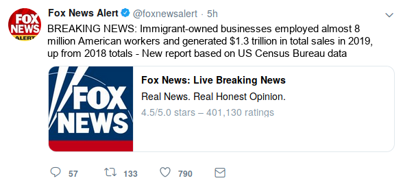

# Study Design & Questionnaire

## Notes

- Only edit this file as `.md` --- not `.docx`!
- add item randomization etc.

## MTurk Details

- *Title:* Media Usage and News Consumption
- *Description:* Answer a short survey about your personal media diet and issues currently discussed in the news.
- *Length:* TBD
- *Reward:* TBD
- *Requirements:* 90% approval rate, location US

## Survey Flow Overview

- Pre-treatment measures:
    - Media usage
    - Exposure to immigration
    - Political attitudes & participation
- Experimental manipulation:
    - Short tweet
    - Full story
- Post-treatment measures:
    - Attitudes towards immigration
    - Trust in news sources
    - Sociodemographics

## Pre-treatment measures

### Block 1: Media usage

First, we want to ask a few questions about your current media diet.

**[socialmedia]** *(show same response options for each, randomize order)* On average, how often do you use the following social media platforms:

- Facebook
- YouTube
- Instagram
- Twitter
- Tumblr

1. Several times a day
2. About once a day
3. 3 to 6 days a week
4. 1 to 2 days a week
5. Every few weeks
6. Less often
7. Never
8. Don’t Know

**[socialmedia_pol]** *(show same response options for each, randomize order)* And how often do you view *political* content on these platforms?

- Facebook
- YouTube
- Instagram
- Twitter
- Tumblr

1. Several times a day
2. About once a day
3. 3 to 6 days a week
4. 1 to 2 days a week
5. Every few weeks
6. Less often
7. Never
8. Don’t Know

**[tvnews]** *(show same response options for each, randomize order)* On average, how often do you watch *political news* on the following TV channels:

- Fox News
- MSNBC
- CNN
- NBC
- CBS

1. Several times a day
2. About once a day
3. 3 to 6 days a week
4. 1 to 2 days a week
5. Every few weeks
6. Less often
7. Never
8. Don’t Know

**[printmedia]** *(show same response options for each, randomize order)* And how often do you read the following newspapers (online or offline):

- New York Times
- Washington Post
- Wall Street Journal
- USA Today
- New York Post

1. Several times a day
2. About once a day
3. 3 to 6 days a week
4. 1 to 2 days a week
5. Every few weeks
6. Less often
7. Never
8. Don’t Know

### Block 2: Racial attitudes (choose one set?)

Next are some questions about different groups in our society.

**[hardworking]** Do you think that people in the following groups are "hard-working" or "lazy"? A score of '1' means that you think almost all of the people in that group tend to be "hard-working." A score of '7' means that you think most people in the group are "lazy." A score of '4' means that you think that most people in the group are not closer to one end or the other, and of course, you may choose any number in between.

- Whites
- Blacks
- Hispanic-Americans
- Asian-Americans

(1) Hard-working - (7) Lazy

**[intelligent]** And do you think that people in the following groups tend to be "intelligent" or "unintelligent"? A score of '1' means that you think almost all of the people in that group tend to be "intelligent." A score of '7' means that you think most people in the group are "unintelligent." A score of '4' means that you think that most people in the group are not closer to one end or the other, and of course, you may choose any number in between.

- Whites
- Blacks
- Hispanic-Americans
- Asian-Americans

(1) Intelligent - (7) Unintelligent

**[resentment]** Do you agree strongly, agree somewhat, neither agree nor disagree, disagree somewhat, or disagree strongly with the following statements?

- Italians, Jewish and many other minorities overcame prejudice and worked their way up. Blacks should do the same without any special favors.
- Generations of slavery and discrimination have created conditions that make it difficult for blacks to work their way out of the lower class.
- Over the past few years blacks have gotten less than they deserve.
- It's really a matter of some people not trying hard enough; if blacks would only try harder they could be just as well off as whites.

1. Agree strongly
2. Agree somewhat
3. Neither agree nor disagree
4. Disagree somewhat
5. Disagree strongly

### Block 3: Political attitudes & participation

Now a few questions about politics.

**[polint]** How often do you pay attention to what's going on in government and politics?

1. Always
2. Most of the time
3. Some of the time
4. Only now and then
5. Hardly at all
6. Never

**[ideology]** Thinking about politics these days, how would you describe your own political viewpoint?

1. Very liberal
2. Liberal
3. Slightly liberal
4. Moderate
5. Slightly conservative
6. Conservative
7. Very conservative
8. Not sure

**[party]** Generally speaking, do you think of yourself as a Republican, a Democrat, an independent, or other?

1. Republican
2. Democrat
3. Independent
4. Other

**[party_lean]** *(if other/independent is selected)*
Do you think of yourself as CLOSER to the Republican Party or to the Democratic Party?

1. Democratic Party
2. Republican Party
3. Neither Party

**[party_strong]** *(if Republican or Democrat is selected)*
Would you consider yourself a strong Republican/Democrat or a not very strong Republican/Democrat?

1. Strong
2. Not very strong

**[problem]** *(randomize order)* What do you think are the most important problems facing this country? Please rank the following issues from the most important to the least important.

1. Unemployment
2. Inequality
3. Federal Deficit
4. Taxes
5. High Cost of Living / Inflation
6. Immigration
7. Health Care
8. Racism
9. Environment / Climate Change
10. Violence / Crime

\newpage

## Experimental Manipulation

- *Control condition:* skip this section
- *Treatment groups:* choice/assigned X controversial/popular
    - *Manipulation 1 (choice/assigned):* Before seeing any content, Rs can either freely choose to view a Fox News or MSNBC tweet, or they are randomly assigned to one of them. In any case, the content of the tweet is the same. 
    - *Manipulation 2 (controversial/popular):* RT ratio suggests either popular (many likes/RTs, few comments) or controversial (few likes/RTs, many comments) content
    - *Outcome measure:* click on link in tweet or click on `next` button?
- After viewing the tweets, respondents are asked to read the full article (whether they clicked on the tweet or not).
    - *Outcome measure:* how much time spent on article?

### Tweets

*Introduction*: Mention that they have to answer questions about the article!

{width=50%}
{width=50%}

{width=50%}
{width=50%}

\newpage

### Full Story: Immigrant-owned Businesses on the Rise

William Hall | [Fox/MSNBC] News

A recent report released using U.S. Census Bureau data states that immigrant-owned businesses employed over 8 million workers in fiscal year 2017, up from 2016 totals. These businesses also saw a rise in the total number of sales over the year, increasing to almost $1.3 trillion.

These statistics are born out of hundreds of success stories across many different sectors of the economy, especially the service industry.

Eduardo Rodriguez, a 62 year old immigrant living in the Little Village neighborhood of Chicago, is a perfect example of this success. The Little Village community has had its economic struggles, with an unemployment rate of 13 percent and an annual median income of $30,000 -- less than half of the national average. These conditions have not stopped Rodriguez, however.  He currently owns and operates four Dulcelandia stores in Little Village, which are packed with over 1,000 types of delicious candies from his home country of Mexico.

After immigrating here in 1966, Rodriguez opened up the store and it became an instant gathering spot in the neighborhood. "People seem to really like what we are doing, and I'm grateful that I had the opportunity to do this in the United States. It takes a lot of work and sacrifice -- we're fulfilling a niche market that people really want to buy from."

Following in her father's footsteps, Rodriguez's daughter, Eve Rodriguez Montoya, has also opened up a handful of shops which specialize in healthy frozen yogurts with some Mexican-inspired flavors.

"Our community is very strong and hard-working -- resilient and resourceful," she said. "I'd say come to our community, get to know our people. Shop at our locations and see for yourself -- Little Village is full of people who came to this country to achieve the American Dream."

{width=45%}

The Rodriguez's story is just one of many: as more immigrants look to open their own businesses, and employ more workers, many markets, both broad and niche, will continue to expand, providing more fuel to an already strong economy.

*William Hall is a Business Reporter for [Fox/MSNBC] News.*

### Sources

- Immigrant story: [link](https://www.cnbc.com/2017/05/02/how-successful-immigrant-entrepreneurs-are-changing-chicago-and-the-us.html)
- Graph: [link](https://www.inc.com/arnobio-morelix/inc-entrepreneurship-index-2018-q1.html)
- Immigrant Statistics: [link](https://www.newamericaneconomy.org/methodology/)
    - This data is aggregated by a group called The New American Economy; it gathers the data from the US Census, many different local OMBs, the  National Bureau of Economic Research, and others. Not 100% sure we can say this was 'released' by the US Census bureau.

\newpage

## Post-treatment measures

### Block 1: Attitudes towards immigration

Next, we want to ask you a few questions about immigration.

**[immig_attitude]** Do you think the number of immigrants from foreign countries who are permitted to come to the United States to live should be...?

1. Increased a lot
2. Increased a little
3. Left the same
4. Decreased a little
5. Decreased a lot

**[employ]** Across the United States, how many workers -- immigrant and US-born -- do you think are employed by immigrant-owned businesses?

- *TEXTBOX* Million
- Don't know

**[sales]** Taking your best guess, what was the total number of sales of immigrant-owned businesses in the last year.

1. Less than $500 billion
2. $500 billion - $1 trillion
3. $1 trillion - $1.5 trillion
4. $1.5 trillion - $2 trillion
5. More than 2 trillion
6. Don't know

**NOTE**: randomize order of remaining questions

**[taxes]** Most people who come to live in the U.S. work and pay taxes.  They also use health and social services.  On balance, do you think people who come here take out more than they put in or put in more than they take out?

- 0 (Generally take out more) - 10 (Generally put in more) & 99 (DK)

**[taxes_oe]** Please explain your answer in a few short sentences. What is the main argument that came to mind when answering the question?

- *TEXTBOX*

**[jobs]** On average, would you say that people who come to live here from other countries will take jobs away from people already here or add to the economy by creating additional jobs?

- 0 (Take jobs away) - 10 (Create additional jobs) & 99 (DK)

**[jobs_oe]** Please explain your answer in a few short sentences. What is the main argument that came to mind when answering the question?

- *TEXTBOX*

**[culture]** And would you say that America's cultural life is generally undermined or enriched by people coming to live here from other countries?

- 0 (Cultural life undermined) - 10 (Cultural life enriched) & 99 (DK)

**[culture_oe]** Please explain your answer in a few short sentences. What is the main argument that came to mind when answering the question?

- *TEXTBOX*

**[crime]** In general, do you think that America's crime problems are made worse or better by people coming to live here from other countries?

- 0 (Made worse) - 10 (Made better) & 99 (DK)

**[crime_oe]** Please explain your answer in a few short sentences. What is the main argument that came to mind when answering the question?

- *TEXTBOX*

## Block 3: Trust in media sources

Let's briefly return to the different media sources mentioned at the beginning of the survey.

**[tvnews_trust]** *(show same response options for each, randomize order)* Overall, how often can you trust the following TV channels that their news reporting is accurate?

- Fox News
- MSNBC
- CNN
- NBC
- CBS

1. Always
2. Most of the time
3. About half the time
4. Some of the time
5. Never
6. Don’t Know

**[printmedia_trust]** *(show same response options for each, randomize order)* And how often can you trust the following newspapers that their reporting is accurate?:

- New York Times
- Washington Post
- Wall Street Journal
- USA Today
- New York Post

1. Always
2. Most of the time
3. About half the time
4. Some of the time
5. Never
6. Don’t Know

## Block 4: Sociodemographics

This almost completes our survey, we only need some additional information about your background.

**[zip]** What is your zip code?

- *TEXTBOX*

**[zip_time]** *(only ask if zip code is entered)* And how long have you lived at your current zip code?

1. Less than a year
2. 1 to 3 years
3. 3 to 5 years
4. More than 5 years
5. Don't Know

**[gender]** Do you consider yourself Male, Female, or other?

1. Male
2. Female
3. Other

**[age]** What is your age?

- *TEXTBOX*

**[usborn]** Were you born in the United States?

1. Yes
2. No

**[usborn_year]** *(only ask if [usborn]==0)* When did you first arrive to live in the US?

- *TEXTBOX*

**[race]** What racial or ethnic group best describes you?

1. White
2. Black or African-American
3. Hispanic or Latino
4. Native American
5. Asian
6. Middle eastern
7. Mixed
8. Other

**[educ]** What is the highest level of education that you have completed?

1. Less than a High school diploma
2. Graduated high school or GED
3. Graduated Two-year college
4. Some college but no college degree
5. Graduated 4-year college
6. Completed post-graduate or professional school, with degree
7. Other
8. Don't know

**[job]** Add question about job / type of work?

**[income]** Thinking back over the last year, what was your family's annual income?

1. Less than $20,000
2. $20,000 - $39,999
3. $40,000 - $59,999
4. $60,000 - $79,999
5. $80,000 - $99,999
6. $100,000 - $119,999
7. $120,000 or more
8. Prefer not to say
