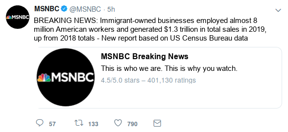

# Study Design & Questionnaire

## Notes

- Only edit this file as `.md` --- not `.docx`!
- add item randomization
- *additional items to consider*: political efficacy, racial resentment, turnout, how many (politicians) followed on twitter, posting on social media

## MTurk Details

- *Title:* Media Usage and News Consumption
- *Description:* Answer a short survey about your personal media diet and issues currently discussed in the news.
- *Time Alotted:* TBD
- *Reward*: TBD
- *Requirements:* 90% approval rate, location US, total approved HITs no less than 100

## Survey Flow Overview

- Pre-treatment measures:
    - Media usage & trust in news
    - Social network and exposure to immigration
    - Political attitudes & attitudes
- Experimental manipulation:
    - Short tweet
    - Full story
- Post-treatment measures:
    - Story evaluation [*treatment group only*]
    - Attitudes towards immigration
    - Sociodemographics

## Pre-treatment measures

### Block 1: Media usage & trust in news

First we want to ask a few questions about your current media diet.

General trust in media

Media usage - traditional sources

Rank media sources in terms of how much you trust them

**[social_view]** *(show same response options for each)* How often do you view content on the following social media platforms: Facebook, YouTube, Instagram, Twitter, Tumblr

1. Several times a day
2. About once a day
3. 3 to 6 days a week
4. 1 to 2 days a week
5. Every few weeks
6. Less often
7. Never
8. Don’t Know

**[social_politics]** *(show same response options for each)* How often do you view content *about politics* on the following social media platforms: Facebook, Twitter, Instagram

1. Several times a day
2. About once a day
3. 3 to 6 days a week
4. 1 to 2 days a week
5. Every few weeks
6. Less often
7. Never
8. Don’t Know

### Block 2: Social network and exposure to immigration

Many people also receive news indirectly, e.g., by talking to neighbors, friends, or family members. Next, we want to ask you a few questions about your social network.

How often do you talk about politics with friends and family

Do they know a lot about politics and the news?

In your day-to-day life, how frequently do you see Hispanic/Latino immigrants in your community?

1. Never or almost never
2. Less than once a month
3. 1-3 times each month
4. At least once a week
5. Every day

In your day-to-day life, how frequently do you have conversations with Hispanic/Latino immigrants?

1. Never or almost never
2. Less than once a month
3. 1-3 times each month
4. At least once a week
5. Every day

In your day-to-day life, how frequently do you hear Spanish spoken?

1. Never or almost never
2. Less than once a month
3. 1-3 times each month
4. At least once a week
5. Every day

G3b
How would you describe the ethnic mix of your current neighborhood where you live? Would you say it is mostly White, mostly Black, mostly Hispanic, mostly Asian, A mix of people from different racial groups, or something else? 

1. Mostly white (Skip to G3.1)
2. Mostly black (Skip to G3.1)
3. Mostly Hispanic or Latino (Skip to G3.1)
4. Mostly Asian (Skip to G3.1)
5. A mix of people from different racial groups
6. Something else (Skip to G3.1)
7. DON’T KNOW (Skip to G3.1)
8. REFUSED (Skip to G3.1)

G3c. Would that be mostly white and black, mostly white and Hispanic, mostly Hispanic and Black, or something else?

1. Mostly white and black
2. Mostly white and Hispanic
3. Mostly black and Hispanic
4. Something else.
8.   DON’T KNOW
9.   REFUSED

### Block 2: Political attitudes & participation

**[ideology]**
Thinking about politics these days, how would you describe your own political viewpoint?

1. Very liberal
2. Liberal
3. Slightly liberal
4. Moderate
5. Slightly conservative
6. Conservative
7. Very conservative
8. Not sure

**[party]**
Generally speaking, do you think of yourself as a Republican, a Democrat, an independent, or other?e

1. Republican
2. Democrat
3. Independent
4. Other

**[party_lean]** *(if other/independent is selected)*
Do you think of yourself as CLOSER to the Republican Party or to the Democratic Party?

1. Democratic Party
2. Republican Party
3. Neither Party

**[party_strong]** *(if Republican or Democrat is selected)*
Would you consider yourself a strong Republican/Democrat or a not very strong Republican/Democrat?

1. Strong
2. Not very strong

Most important problem

- give 10 options, choose 3

Measure of racial threat? support for welfare?

\newpage

## Main Treatment

- First treatment: tweet (search/assigned X source X pro/con X RT ratio)
        - Outcome measure: click on link or click on next?
    - Second treatment: full article (same groups as before)
        - Outcome measure: how much time spent on article?

- Info search: assigned to source (Fox/MSNBC) vs. choosing one
- RT Ratio: popular vs. controversial according to Comment/RT&Like ratio
- Control condition: now exposure
- *Note*: Include measure to capture whether participants click on the story link in the initial tweet

### Tweets

{width=50%}
{width=50%}

{width=50%}
{width=50%}

\newpage

### Full Story: Immigrant-owned Businesses on the Rise

William Hall | [Fox/MSNBC] News

A recent report released using U.S. Census Bureau data states that immigrant owned businesses employed over 8 million workers in fiscal year 2017, up from 2016 totals. These businesses also saw a rise in the total number of sales over the year, increasing to almost $1.3 trillion.

These statistics are born out of hundreds of success stories across many different sectors of the economy, especially the service industry.

Eduardo Rodriguez, a 62 year old immigrant living in the Little Village neighborhood of Chicago, is a perfect example of this success. The Little Village community has had its economic struggles, with an unemployment rate of 13 percent and an annual median income of $30,000 -- less than half of the national average. These conditions have not stopped Rodriguez, however.  He currently owns and operates four Dulcelandia stores in Little Village, which are packed with over 1,000 types of delicious candies from his home country of Mexico.

After immigrating here in 1966, Rodriguez opened up the store and it became an instant gathering spot in the neighborhood. "People seem to really like what we are doing, and I'm grateful that I had the opportunity to do this in the United States. It takes a lot of work and sacrifice -- we're fulfilling a niche market that people really want to buy from."

Following in her father's footsteps, Rodriguez's daughter, Eve Rodriguez Montoya, has also opened up a handful of shops which specialize in healthy frozen yogurts with some Mexican-inspired flavors.

"Our community is very strong and hard-working -- resilient and resourceful," she said. "I'd say come to our community, get to know our people. Shop at our locations and see for yourself -- Little Village is full of people who came to this country to achieve the American Dream."

{width=45%}

The Rodriguez's story is just one of many: as more immigrants look to open their own businesses, and employ more workers, many markets, both broad and niche, will continue to expand, providing more fuel to an already strong economy.

*William Hall is a Business Reporter for [Fox/MSNBC] News.*

### Sources

- Immigrant story: [link](https://www.cnbc.com/2017/05/02/how-successful-immigrant-entrepreneurs-are-changing-chicago-and-the-us.html)
- Graph: [link](https://www.inc.com/arnobio-morelix/inc-entrepreneurship-index-2018-q1.html)
- Immigrant Statistics: [link](https://www.newamericaneconomy.org/methodology/)
    - This data is aggregated by a group called The New American Economy; it gathers the data from the US Census, many different local OMBs, the  National Bureau of Economic Research, and others. Not 100% sure we can say this was 'released' by the US Census bureau.

\newpage

## Post-treatment measures

- Attitudes towards immigration
- Perception of migrants' contribution to economy
- Evaluate Fox, MSNBC
- Sociodemographics etc.

We are eager to learn what you think about various issues facing America today.

### Block 1: Story Evaluation / Manipulation check [ONLY INCLUDE IN TREATMENT CONDITION]

General comprehension question about story

Agree / Disagree with main story

How does R feel about the particular news source?

### Block 1: Main outcome measures

**immig_attd:** Do you think the number of immigrants from foreign countries who are permitted to come to the United States to live should be...?  

1. Increased a lot
2. Increased a little
3. Left the same
4. Decreased a little
5. Decreased a lot

**unemp:** Out of every 100 people living in the United States, how many do you think were born outside of the country? [Response is given in textbox; only responses 0-100 are allowed.  Don't know option is also provided.]

- 0-100 *SLIDER*
- 999 Don't know

Most people who come to live in the U.S. work and pay taxes.  They also use health and social services.  On balance, do you think people who come here take out more than they put in or put in more than they take out?

- 0 (Generally take out more) - 10 (Generally put in more) & 99 (DK)

You answer to the previous question was *X*. Please explain your answer in a few short sentences. What is the main argument that came to mind when answering the question?

- *TEXTBOX*

On average, would you say that people who come to live here from other countries will take jobs away from people already here or add to the economy by creating additional jobs?

- 0 (Take jobs away) - 10 (Create additional jobs) & 99 (DK)

You answer to the previous question was *X*. Please explain your answer in a few short sentences. What is the main argument that came to mind when answering the question?

- *TEXTBOX*

And would you say that America's cultural life is generally undermined or enriched by people coming to live here from other countries?

- 0 (Cultural life undermined) - 10 (Cultural life enriched) & 99 (DK)

You answer to the previous question was *X*. Please explain your answer in a few short sentences. What is the main argument that came to mind when answering the question?

- *TEXTBOX*

In general, do you think that America's crime problems are made worse or better by people coming to live here from other countries?

- 0 (Made worse) - 10 (Made better) & 99 (DK)

You answer to the previous question was *X*. Please explain your answer in a few short sentences. What is the main argument that came to mind when answering the question?

- *TEXTBOX*

## Block 2: Sociodemographics

**gender:** Do you consider yourself Male, Female, or other?

1. Male
2. Female
3. Other

**age:** What is your age?

- *TEXTBOX*

**race:** What racial or ethnic group best describes you?

1. White
2. Black
3. Hispanic
4. Native American
5. Asian
6. Middle eastern
7. Mixed
8. Other

Were you born in the United States?

1. Yes
2. No [if no, ask: When did you first arrive to live in the US?]

What is the highest level of education you have completed?
F8.  What is the highest grade or level of school that you have completed?

1. Less than a High school diploma,
2. Graduated high school or GED,
3. Graduated Two-year college,
4. Some college but no college degree,
5. Graduated 4-year college,
6. Completed post-graduate or professional school, with degree
7. Other
8. DON’T KNOW
9. Refused/NA

Thinking back over the last year, what was your family's annual income?

1. Less than $20,000
2. $20,000 - $39,999
3. $40,000 - $59,999
4. $60,000 - $79,999
5. $80,000 - $99,999
6. $100,000 - $119,999
7. $120,000 or more
8. Prefer not to say

Zip Code

- *TEXTBOX*
