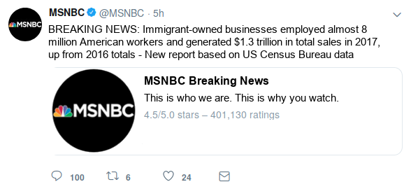

# Study Design & Questionnaire

## Survey Flow Overview

- Pre-treatment measures:
    - Media usage
    - Stereotype battery
    - Political attitudes & participation
- Experimental manipulation:
    - Tweets
    - Full story
    - Attention checks
- Post-treatment measures:
    - Attitudes towards immigration
    - Trust in news sources
    - Sociodemographics

## Treatment Overview

- **Basic design:** 2 X 2 + 1 (choice/assigned X controversial/popular + control)
    - _Treatment 1 (choice/assigned):_ Before being able to view their contents, participants are either asked to choose between a Fox News or MSNBC tweet, or they are randomly assigned to one of them. In any case, the content of the tweet is held constant. After reading the tweet, participants are asked to read the full article linked in the tweet.
    - _Treatment 2 (controversial/popular):_ Comments vs. Retweets/Likes ratio suggests either popular (many likes/RTs, few comments) or controversial (few likes/RTs, many comments) content.
    - _Control condition:_ skip tweet & full story

- **Outcome measures:**
    - Do participants directly click on the link in the tweet or click on `next` button?
    - How much time do participants spend on the full article?
    - Basic comprehension / attention check.
    - Attitudes towards immigration (see post-treatement section).
    - Trust in news sources (see post-treatement section).

## MTurk Details

- *Title:* Media Usage and News Consumption
- *Description:* Answer a short survey about your personal media diet and issues currently discussed in the news.
- *Length:* TBD
- *Reward:* TBD (>$0.50)
- *Requirements:* 90% approval rate, location US

## Pre-treatment measures

### Block 1: Media usage

First, we want to ask a few questions about your current media diet.

**[socialmedia]** *(show same response options for each)* On average, how often do you use the following social media platforms?

- YouTube
- Facebook
- Instagram
- Twitter
- Tumblr

1. Several times a day
2. About once a day
3. 3 to 6 days a week
4. 1 to 2 days a week
5. Every few weeks
6. Less often
7. Never
8. Don’t Know

**[socialmedia_pol]** *(show same response options for each)* And how often do you view *political* content on these platforms?

- YouTube
- Facebook
- Instagram
- Twitter
- Tumblr

1. Several times a day
2. About once a day
3. 3 to 6 days a week
4. 1 to 2 days a week
5. Every few weeks
6. Less often
7. Never
8. Don’t Know

**[tv]** *(show same response options for each, randomize order)* On average, how often do you watch _political_ news on the following TV channels:

- Fox News
- MSNBC
- CNN
- NBC
- CBS

1. Several times a day
2. About once a day
3. 3 to 6 days a week
4. 1 to 2 days a week
5. Every few weeks
6. Less often
7. Never
8. Don’t Know

**[print]** *(show same response options for each, randomize order)* And how often do you read about articles about _politics_ in the following newspapers (online or offline)?

- New York Times
- Washington Post
- Wall Street Journal
- USA Today
- New York Post

1. Several times a day
2. About once a day
3. 3 to 6 days a week
4. 1 to 2 days a week
5. Every few weeks
6. Less often
7. Never
8. Don’t Know

### Block 2: Stereotype battery

Next are some questions about different groups in our society.

**[hw_age]** *(show same response options for each)* Do you think that people in the following groups are "hard-working" or "lazy"?

- Silent Generation (born 1945 and before)
- Baby Boomers (born 1946-1964)
- Generation X (born 1965-1976)
- Millennials (born 1977-1995)

(1) Hard-working - (7) Lazy, (8) DK

**[hw_race]** *(show same response options for each, randomize order)* Do you think that people in the following groups are "hard-working" or "lazy"?

- Whites
- Blacks
- Hispanic-Americans
- Asian-Americans

(1) Hard-working - (7) Lazy, (8) DK

**[hw_job]** *(show same response options for each, randomize order)* Do you think that people in the following groups are "hard-working" or "lazy"?

- Farmers
- Teachers
- Lawyers
- Bankers

(1) Hard-working - (7) Lazy, (8) DK

### Block 3: Political attitudes & participation

Next, we would like you to answer a few questions about your political viewpoints.

**[polint]** How often do you pay attention to what's going on in government and politics?

1. Always
2. Most of the time
3. Sometimes
4. Hardly at all
5. Never

**[problem]** *(randomize order)* What do you think are the most important problems facing this country? Please rank the following issues from the most important to the least important.

1. Unemployment
2. Inequality
3. Federal Deficit
4. Taxes
5. High Cost of Living / Inflation
6. Immigration
7. Health Care
8. Racism
9. Environment / Climate Change
10. Violence / Crime

**[ideology]** Thinking about politics these days, how would you describe your own political viewpoint?

1. Very liberal
2. Liberal
3. Slightly liberal
4. Moderate
5. Slightly conservative
6. Conservative
7. Very conservative
8. Not sure

**[pid]** Generally speaking, do you think of yourself as a Republican, a Democrat, an independent, or other?

1. Republican
2. Democrat
3. Independent
4. Other

**[pid_lean]** *(if [pid] == other | independent)*
Do you think of yourself as CLOSER to the Republican party or to the Democratic party?

1. Republican party
2. Democratic party
3. Neither party

**[pid_rep/pid_dem]** *(if [pid] == Republican | Democrat)*
Would you consider yourself a strong Republican/Democrat or a not very strong Republican/Democrat?

1. Strong
2. Not very strong

<!-- \newpage -->

## Experimental manipulation

### Instructions for participants

- **Treatment 1 = choice**
    - In the following section, we are going to show you a random tweet drawn from the accounts of several large news organizations. You can choose from which Twitter account the random tweet will be drawn. Afterwards, we are going to ask you some questions about the content of the news story.
    - **[choice]** _(randomize order)_ From which Twitter account would you like to view a random tweet?
        
        1. Fox News
        2. MSNBC

- **Treatment 1 = assigned**
    - In the following section, we are going to show you a random tweet drawn from the accounts of several large news organizations. Afterwards, we are going to ask you some questions about the content of the news story.
    - **[assigned]** _(assignment to account invisible to participant)_
        
        1. Fox News
        2. MSNBC

### Tweets

{width=50%}
{width=50%}

{width=50%}
{width=50%}

### Introduction for full story

Next, we will show you the content of the article linked in the previous tweet. Please click on the `next` button and read the story carefully. Keep in mind that you will be asked questions about the content of the article afterwards.

### Full Story: Immigrant-owned Businesses on the Rise

William Hall | [Fox News/MSNBC]

A recent report released using U.S. Census Bureau data states that immigrant-owned businesses employed over 8 million workers in fiscal year 2017, up from 2016 totals. These businesses also experienced an increase in the total amount of sales revenue, which rose to almost $1.3 trillion during the same period.

These statistics are born out of hundreds of success stories across many different sectors of the economy, especially the service industry.

Eduardo Rodriguez, a 62 year old immigrant living in the Little Village neighborhood of Chicago, is a perfect example of this success. In an area of the city that has an unemployment rate of 13 percent and an annual median income of $30,000--less than half of the national average--the Little Village community faces considerable economic challenges. However, these conditions have not stopped Rodriguez.  He currently owns and operates four Dulcelandia stores in Little Village, each one packed with over 1,000 types of delicious candies from his home country of Mexico.

After immigrating here in 1966, Rodriguez opened his first store and it became an instant gathering spot in the neighborhood. "People seem to really like what we are doing, and I'm grateful that I had the opportunity to do this in the United States. It takes a lot of work and sacrifice -- we're fulfilling a niche market that people really want to buy from."

Following in her father's footsteps, Rodriguez's daughter, Eve Rodriguez Montoya, has also opened up a handful of shops that specialize in healthy frozen yogurts with some Mexican-inspired flavors.

"Our community is very strong and hard-working -- resilient and resourceful," she said. "I'd say come to our community, get to know our people. Shop at our locations and see for yourself -- Little Village is full of people who came to this country to achieve the American Dream."

{width=45%}

The Rodriguez's story is just one of many. As more immigrants look to open their own businesses and employ more workers, many markets, both broad and niche, will continue to expand and provide more fuel to an already strong economy.

*William Hall is a Business Reporter for [Fox News/MSNBC].*

### Attention checks

Please answer the following questions about the tweet as well as the article you just read. _(randomize order of questions)_

**[source]** *(randomize order)*  Which Twitter account was the news story from?

1. Fox News
2. MSNBC
3. New York Times
4. Wall Street Journal
5. Don't know

**[about]** *(randomize order)* Broadly speaking, what was the news story about?

1. Immigrant-owned businesses
2. Stock market development
3. Innovation in the automotive industry
4. Young entrepreneurs in Silicon Valley
5. Don't know

### Sources for story

- Immigrant story: [link](https://www.cnbc.com/2017/05/02/how-successful-immigrant-entrepreneurs-are-changing-chicago-and-the-us.html)
- Graph: [link](https://www.inc.com/arnobio-morelix/inc-entrepreneurship-index-2018-q1.html)
- Immigrant Statistics: [link](https://www.newamericaneconomy.org/methodology/)
    - This data is aggregated by a group called The New American Economy; it gathers the data from the US Census, many different local OMBs, the  National Bureau of Economic Research, and others. Not 100% sure we can say this was 'released' by the US Census bureau.

<!-- \newpage -->

## Post-treatment measures

### Block 1: Attitudes towards immigration

In this section, we want to ask you a few questions about immigration.

**[immig_attitude]** Do you think the number of immigrants from foreign countries who are permitted to come to the United States to live should be...?

1. Increased a lot
2. Increased a little
3. Left the same
4. Decreased a little
5. Decreased a lot

**[employ]** Across the United States, how many workers -- immigrant and US-born -- do you think are employed by immigrant-owned businesses?

- *TEXTBOX* Million
- Don't know

**[sales]** Taking your best guess, what was the total number of sales of immigrant-owned businesses in the last year.

1. Less than $500 billion
2. $500 billion - $1 trillion
3. $1 trillion - $1.5 trillion
4. $1.5 trillion - $2 trillion
5. More than 2 trillion
6. Don't know

**NOTE**: randomize order of remaining questions

**[taxes]** Most people who come to live in the U.S. work and pay taxes.  They also use health and social services.  On balance, do you think people who come here take out more than they put in or put in more than they take out?

- 0 (Generally take out more) - 10 (Generally put in more) & 99 (DK)

**[taxes_oe]** Please explain your answer in a few short sentences. What is the main argument that came to mind when answering the question?

- *TEXTBOX*

**[jobs]** On average, would you say that people who come to live here from other countries will take jobs away from people already here or add to the economy by creating additional jobs?

- 0 (Take jobs away) - 10 (Create additional jobs) & 99 (DK)

**[jobs_oe]** Please explain your answer in a few short sentences. What is the main argument that came to mind when answering the question?

- *TEXTBOX*

### Block 2: Trust in news sources

Let's briefly return to the different media sources mentioned at the beginning of the survey.

**[tvnews_trust]** *(show same response options for each, randomize order)* Overall, how often can you trust the following TV channels that their political news reporting is accurate?

- Fox News
- MSNBC
- CNN
- NBC
- CBS

1. Always
2. Most of the time
3. About half the time
4. Some of the time
5. Never
6. Don’t Know

**[printmedia_trust]** *(show same response options for each, randomize order)* And how often can you trust the following newspapers that their political reporting is accurate?:

- New York Times
- Washington Post
- Wall Street Journal
- USA Today
- New York Post

1. Always
2. Most of the time
3. About half the time
4. Some of the time
5. Never
6. Don’t Know

### Block 3: Sociodemographics

This almost completes our survey, we only need some additional information about your background.

**[zip]** What is your zip code?

- *TEXTBOX* *(response not required)*

**[zip_time]** *(only ask if zip code is entered)* And how long have you lived at your current zip code?

1. Less than a year
2. 1 to 3 years
3. 3 to 5 years
4. More than 5 years
5. Don't Know

**[gender]** Do you consider yourself Male, Female, or other?

1. Male
2. Female
3. Other

**[age]** What is your age?

- *TEXTBOX*

**[usborn]** Were you born in the United States?

1. Yes
2. No

**[usborn_year]** *(only ask if [usborn]==0)* When did you first arrive to live in the US?

- *TEXTBOX*

**[race]** What racial or ethnic group best describes you?

1. White
2. Black or African-American
3. Hispanic or Latino
4. Native American
5. Asian
6. Middle eastern
7. Mixed
8. Other

**[educ]** What is the highest level of education that you have completed?

1. Less than a High school diploma
2. Graduated high school or GED
3. Graduated Two-year college
4. Some college but no college degree
5. Graduated 4-year college
6. Completed post-graduate or professional school, with degree
7. Other
8. Don't know

**[income]** Thinking back over the last year, what was your family's annual income?

1. Less than $20,000
2. $20,000 - $39,999
3. $40,000 - $59,999
4. $60,000 - $79,999
5. $80,000 - $99,999
6. $100,000 - $119,999
7. $120,000 or more
8. Prefer not to say
