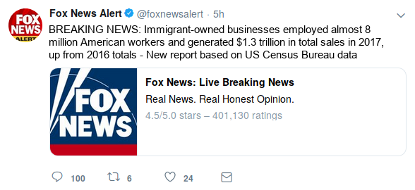
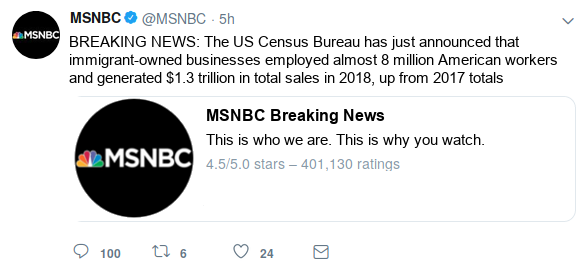
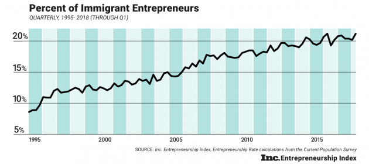

# Study Design & Questionnaire

*Notes*:

- Only edit this file as `.md`, not `.docx`.
- I used the material from Hopkins 2019 as an initial template for the survey questions, make sure to cite him in this context.
- I just started collecting potential items, selection and ordering is by no means final.
- Think about how the study will be advertised on MTurk: e.g., "Study on Online News and Political Attitudes" (add full description)

## Survey Flow Overview

- Pre-treatment measures:
  - Media usage
  - General ideology
  - Political Interest
  - Optional: Racial resentment and similar scales
- Experiment:
  - First treatment: tweet (search/assigned X source X pro/con X RT ratio)
  - First outcome: click on link or click on next?
  - Second treatment: full article (same groups as before)
- Post-treatment measures
  - Basic immigration attitudes
  - Perception of migrants' contribution to economy
  - Sociodemographics etc. (beware of post-treatment bias!)

## Pre-treatment measures

Were you born in the United States?

  1) Yes
  2) No [if no, as: When did you first arrive to live in the US?]

Are you a veteran of the U.S. armed forces?  

  1) Yes
  2) No

In your day-to-day life, how frequently do you see Hispanic/Latino immigrants in your community?

  1) Never or almost never
  2) Less than once a month
  3) 1-3 times each month
  4) At least once a week
  5) Every day

In your day-to-day life, how frequently do you have conversations with Hispanic/Latino immigrants?

  1) Never or almost never
  2) Less than once a month
  3) 1-3 times each month
  4) At least once a week
  5) Every day

In your day-to-day life, how frequently do you hear Spanish spoken?

  1) Never or almost never
  2) Less than once a month
  3) 1-3 times each month
  4) At least once a week
  5) Every day

About how many CLOSE FRIENDS do you have these days?  These are people you feel at ease with, can talk to about private matters, or call on for help.   Would you say that you have...?

  1) No close friends
  2) 1-2 close friends
  3) 3-5 close friends
  4) 6-10 close friends
  5) More than 10 close friends

Of these close friends, how many are Hispanic or Latino immigrants?

  1) None of my close friends
  2) 1-2 of my close friends
  3) 3-5 of my close friends
  4) 6-10 of my close friends
  5) More than 10 of my close friends

Other items to add:

- Media usage, especially twitter!
- Ideology
- Party identification
- Political participation / engagement
- Political efficacy
- Trust in media?

## Main Treatment

- Info search: assigned to source (Fox/MSNBC) vs. choosing one
- RT Ratio: popular vs. controversial according to Comment/RT&Like ratio
- Control condition: now exposure
- *Note*: Include measure to capture whether participants click on the story link in the initial tweet

### Initial Tweet

- Fox News - controversial

- Fox News - popular

- MSNBC - controversial

- MSNBC - popular

### Full Story: Immigrant Entrepreneur Numbers on the Rise

> Immigrant-owned businesses employed almost 8 million American workers
William Hall | Fox News

A recent report released from the U.S. Census Bureau states that immigrant owned businesses employed over 8 million workers in fiscal year 2017, up from the 2016 total of X. This sector of the economy also saw a rise in the total number of sales over the year, increasing to almost $1.3 trillion in 2017.

These statistics form into hundreds of success stories across many different sectors of the economy, especially the service industry.

Eduardo Rodriguez, a 66 year old immigrant living in the Little Village neighborhood of Chicago, is a perfect example of this success. Rodriguez owns four Dulcelandia stores, which are packed with over 1,000 types of delicious candies from his home country of Mexico.

After immigrating here in 1966, Rodriguez opened up the store and it became an instant gathering spot in the neighborhood. "People seem to really like what we are doing, and I'm grateful that I had the opportunity to do this in the United States. It takes a lot of work and sacrifice."

> "We're fulfilling a niche market that people really wanted to buy from"

Following in her father's footsteps, Rodriguez's daughter, Eve Rodriguez Montoya, has also opened up a handful of shops which specialize in healthy frozen yogurts with some Mexican-inspired flavors.

"Our community is very strong and hard-working — resilient and resourceful," she said. "I'd say come to our community, get to know our people. Shop at our locations and see for yourself —Little Village is full of people who came to this country to achieve the American Dream."

The Rodriguez's story is just one of many: as more immigrants look to open their own businesses, and employ more workers, many markets, both broad and niche, will continue to expand, providing more fuel to the many different sectors of the economy.

*William Hall is a Politics Reporter for Fox News.*

### Sources

- [Immigrant story](https://www.cnbc.com/2017/05/02/how-successful-immigrant-entrepreneurs-are-changing-chicago-and-the-us.html)
- [Graph](https://www.inc.com/arnobio-morelix/inc-entrepreneurship-index-2018-q1.html)
- [Immigrant Statistics](https://www.newamericaneconomy.org/methodology/) - This data is aggregated by a group called The New American Economy; it gathers the data from the US Census, many different local OMBs, the  National Bureau of Economic Research, and others. Not 100% sure we can say this was 'released' by the US Census bureau.

## Post-treatment measures

We are eager to learn what you think about various issues facing America today. Please tell us if you agree or disagree with the following statement:

*These days, I am afraid that the American way of life threatened.*

Do you agree strongly, agree somewhat, disagree somewhat, or disagree strongly?

  1) Disagree strongly
  2) Disagree somewhat
  3) Agree somewhat
  4) Agree strongly

Do you think the number of immigrants from foreign countries who are permitted to come to the United States to live should be...?  

  1) Decreased a lot
  2) Decreased a little
  3) Left the same
  4) Increased a little
  5) Increased a lot

How likely is it that the immigrants currently coming into the U.S. will take jobs away from people already here?

  1) Not at all likely
  2) Somewhat likely
  3) Very likely
  4) Extremely likely

How likely is it that current and future immigration will threaten the American way of life?

  1) Not at all likely
  2) Somewhat likely
  3) Very likely
  4) Extremely likely

Please tell us if you agree or disagree with the following statement:

*As a result of more immigrants coming to [your community / this country], taxes will rise.*

Would you say you agree strongly, agree somewhat, disagree somewhat, or disagree strongly?

  1) Disagree strongly
  2) Disagree somewhat
  3) Agree somewhat
  4) Agree strongly

Please tell us if you agree or disagree with the following statement:

*As a result of more immigrants coming to [your community / this country], violence and crime will increase.*

Would you say you agree strongly, agree somewhat, disagree somewhat, or disagree strongly?

  1) Disagree strongly
  2) Disagree somewhat
  3) Agree somewhat
  4) Agree strongly

Please tell us if you agree or disagree with the following statement:
  
*[Illegal immigrants / Immigrants / Legal immigrants] could take jobs from people who are already here.*

Would you say you agree strongly, agree somewhat, disagree somewhat, or disagree strongly?  

  1) Disagree strongly
  2) Disagree somewhat
  3) Agree somewhat
  4) Agree strongly

*Immigration estimate*: Out of every 100 people living in the United States, how many do you think were born outside of the country? [Response is given in textbox; only responses 0-100 are allowed.  Don't know option is also provided.]

- 0-100 \<response entered in textbox\>
- 999 Don't know

Do you think the number of immigrants from foreign countries who are permitted to come to the United States to live should be...?  

  1) Increased a lot
  2) Increased a little
  3) Left the same
  4) Decreased a little
  5) Decreased a lot

Most people who come to live in the U.S. work and pay taxes.  They also use health and social services.  On balance, do you think people who come here take out more than they put in or put in more than they take out?

- 0 (Generally take out more) - 10 (Generally put in more) & 99 (DK)

And would you say that America's cultural life is generally undermined or enriched by people coming to live here from other countries?

- 0 (Cultural life undermined) - 10 (Cultural life enriched) & 99 (DK)

In general, do you think that America's crime problems are made worse or better by people coming to live here from other countries?

- 0 (Made worse) - 10 (Made better) & 99 (DK)

Sociodemographics etc.:

- Gender
- Education
- Employment
- Income?
