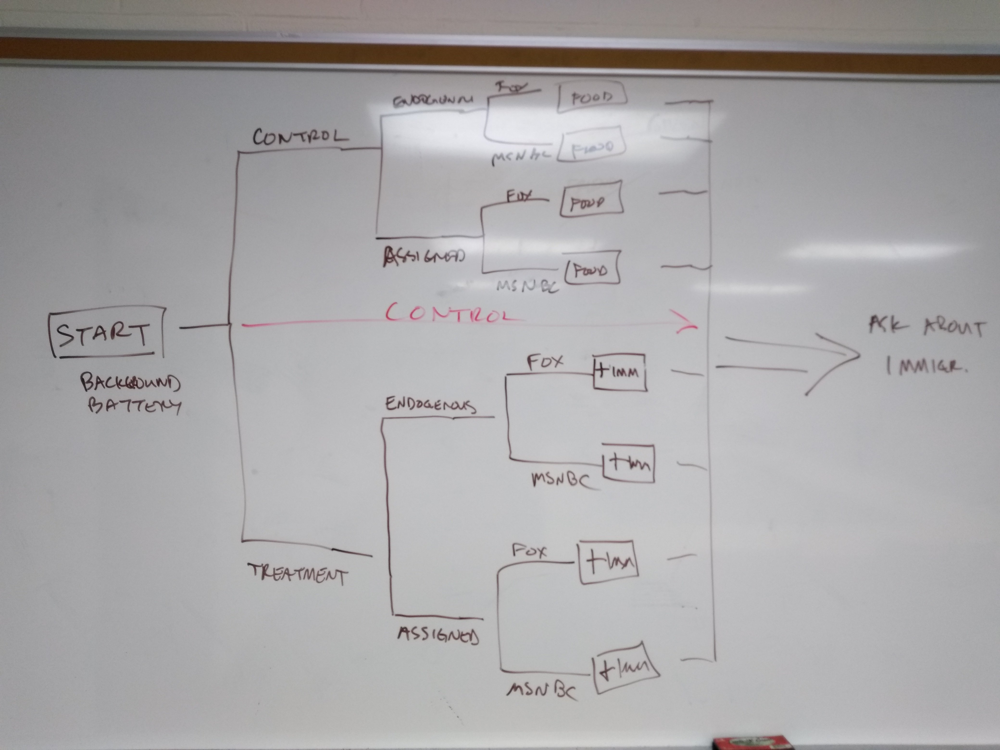

<!--- 
    Created by Nicholas R. Davis (nicholas@democracyobserver.org)
    on 2019-05-31 13:51:11. 

    Vignettes Discussion 
 -->

# Treatment Group Vignette

This information will be migrated from the file Jason was working on.

# Control Group Vignette

**Issue 1:** We are not certain that there is a need for a separate (neutral) vignette for the control group. See the following image for our understanding of the design:

Everything above the red line is the control group as we have thought of it before; however, we contend that the red line is the *actual* representation of the control group's progression through the survey experiment. 

Since we have decided on a single story (i.e. number 3 from Jason's list) we only have a positive treatment. Before we thought there would be two frames-- one positive and one negative. Now, we just have one actual frame.

TLDR; manipulations for the control group are not actually relevant when there is only a positive treatment. 

**Issue 2:** Should our "solution" to issue 1 not be convincing to the group, here are some alternative frames for the control group.

* food irradiation[^fn1] 
* airbag safety - lives saved 
* internal migration statistics 

# Notes

[^fn1]: This is when food is exposed to gamma rays to treat it for bacteria and such.