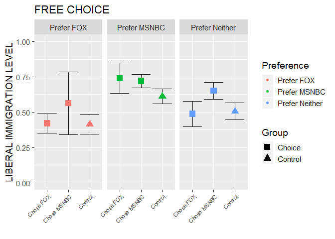
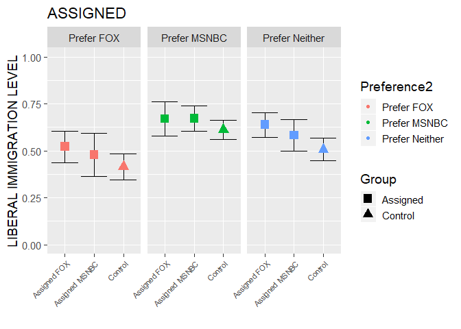

```{r setup, include=FALSE}
knitr::opts_chunk$set(echo = TRUE)
```

```{r, warning=FALSE, message=FALSE, echo=FALSE}
## Packages

##install.packages("here")
library(here)
##install.packages("readr")
library(readr)
library(tidyverse)
library(ggplot2)
##install.packages("expss")
library(expss)
##install.packages("broom")
library(broom)
##install.packages("purrr")
library(purrr)
##install.packages("stargazer")
library(stargazer)
library(lmtest)
library(MASS)
library(car)
```

\clearpage


# Introduction

Citizens in western democracies hold wide-ranging and systematic misperceptions about immigrants to their home countries. For example, people usually overestimate the total number of immigrants or the proportion of immigrants that are dependent on social welfare [e.g., @alesina2019immigration]. Given this extensive spread of misinformation, various studies examined how corrective information may affect people's underlying attitudes towards immigration, albeit with limited success. Although corrective information may alleviate factual misperceptions, it rarely affects people's underlying attitudes [see for example @hopkins2019muted].

One possible explanation for this apparent disconnect could be that factual information is simply irrelevant for attitude formation and---if anything---serves as a mere justification for people to rationalize their existing predispositions towards immigrant populations. However, such motivated reasoning is not without limits---as people have been shown to update their prior beliefs after reaching a "tipping point" of counter-attitudinal information [@redlawsk2010affective]. Furthermore, recent research demonstrates the persuasiveness of canvassing interventions in changing peoples attitudes on immigration [@kalla2020reducing].

In this paper, we explore an alternative explanation for the lack of evidence that corrective information shifts people's attitudes. Specifically, despite a large exisiting body of literature on the importance of source cues [e.g., @goren2009source; @ladd2010role], prior studies on misinformation corrections rarely consider the potential role of source credibility. Furthermore, most experimental designs simply assign a random informational treatment to a subset of their sample, which does not allow us to estimate a key quantity of interest: the effect of misinformation corrections among *people who would have chosen to access the information in the first place* [see also @benedictis2019persuading; @knox2019design].

<!-- For example, one important factor that has been examined in the past focuses on source credibility. However, what has been understudied in this process is the opportunity to choose information sources (rather than simply being exposed to them). This is particularly relevant in the context of our changing media environment where people have much more discretion over their information diet... -->

We address these shortcomings of previous research by implementing an experimental design that varies both, the source of misinformation corrections as well as its delivery mode (i.e., the process through which people access the information). Specifically, we conduct an online survey experiment on the effectiveness of corrective information on misperceptions about the economic impact of legal immigration. Depending on the experimental condition, participants are either able to freely choose--or are assigned to--an article published by different news channels (Fox News vs. MSNBC), which discusses the economic impact of legal immigration. After reading the article, participants are asked to evaluate the news story and answer general questions about their attitudes towards immigration.

A better understanding of the role of source credibility and delivery mode is crucial in our rapidly changing media environment where people have unprecedented control over their information diets. While people can access an ever-growing set of news outlets of varying quality, we only have a limited understanding as to how these systemic changes in information channels moderate the effectiveness of corrective information itself. Past research mostly focused on the effect of different _types_ of misinformation corrections. This study contributes to the literature by shifting the focus to the question of _how_ and _from where_ corrective information reaches people. Our results suggest that source credibility is more important than the delivery mode.

# Why misinformation corrections (often) fail


- Motivated reasoning review: How individuals treat facts and other types of information depends on their incentives (motivation + ability). Reliance on cues/heuristics like ideological predispositions. Absent substantial motivation to accurately process information, individuals interpret new information in light of their extant attitudes. A compelling explanation of this pattern is the tendency to engage in motivated reasoning. Humans = biased information seekers [@kunda1990case, @Taber2006] and asymmetric updaters [@sunstein2016people].

- 2 possible explanations for differential effects:

1. attitudes are harder to change, dependent on multiple considerations, often relate to identity
2. reverse causation

## Differentiating factual beliefs, interpretations, and opinions

<!-- - model of persuasion: source cues, etc. -->


People form different interpretations from the same facts. This seems to have increased recently. The facts, or objective information, surrounding climate change, impeachment, and COVID-19 are interpreted differently. As people interpreted these facts opinions were formed that informed attitudes. Attitudes are a set of emotions, beliefs, behaviors towards an object, person or event. How a person interprets the facts of COVID-19 interpreted their behavior as the event unfolded.

Factual beliefs become relevant for political judgments only when people interpret them.
Even though people update their factual beliefs as conditions change, individuals can interpret the same factual beliefs differently depending on characteristics such as their partisanship. Many times interpretations, rather than factual beliefs drive opinions [@gaines2007same]
[Interpretations]? give opportunity to rationalize existing opinions and attitudes. Rationalizations include evaluations such as the number casualties is modest loss, or number of immigrations is high or low. Another form of rationalizations are explanations. An example of this is the explanation that there were no weapons of mass destruction found in Iraq because they never existed. [More relevant example for our study?] Lastly, inferences such as spending on war can mean domestic needs are ignored. Another rationalization could lead to questions such as an immigration tradeoff or redistribution.
Interpretations afford leeway to align factual beliefs with undeniable reality and continue to justify partisan preferences. As events unfold, onslaught of evidence-ex. Figures recited on daily news-can trump partisan motivation with respect to factual beliefs. Motivation colors judgement, but people are also motivated to be rational [@kunda1990case].

A substantial body of research indicates that factual belief and knowledge is reliably associated with ideologically constrained attitude. The underlying assumption is that individuals will develop ideologically organize their attitudes toward specific political issue if they have acquired enough information for forming the conceptual content of the left-right continuum. Therefore, a person who possesses more well-developed political schemas, or well-organized pieces of political information is more likely has clear issue stances/attitudes [@zaller1992nature, @stimson2015tides]. 
Evaluative Motivation [@federico2007expertise] suggests that the critical process relates to the need to use factual beliefs for evaluative purposes. In this vein, the use of ideology actually consists of two different processes: first, factual belief provides individuals an understanding of the left-right continuum, enabling them to meaningfully identify themselves with an ideological position Secondly, resulting ideological predispositions can then be used for evaluative judgment about a broader set of political issue.

Can correct information change attitudes? Correct information can change factual beliefs or perceptions but not necessarily related attitudes [@hopkins2019muted]. Do facts influence attitudes? Jury is out, but probably not (i.e. Hopkins et al 2019). Whether people update and what it means to update is up for debate. 

Why don't people update their related attitudes? One explanation is that they first have to be interpreted either by individuals themselves or by letting others do it for them [@gaines2007same]. "People cannot turn to a manual to determine if an additional 50 troop casual-ties during the past month represents a big, moderate, or small loss."


## The role of media choice, source credibility, and selective exposure

Mass media is by far the most regular used information source. @dalton1998partisan found that perception of news is shaped as much by a person's political views as by objective content. Even if an individual perceives their news source as unbiased, they will perceive their daily news source to report biased information. They found that regardless of the paper's actual stance it was viewed as skewed toward the opposite political beliefs of the reader. Individuals with strong partisan beliefs are more skeptical that "neutral" media reports with accuracy and believe the media as biased against their beliefs [@little2019distortion].

Sources that are deemed credible are more influential than sources with low credibility. Credibility includes both expertise and trustworthiness and studies have found that source credibility impacts whether individuals will correct misinformation [@guillory2013correcting]. One would assume that non-partisan authorities would be a trusted source of information. However, in a time when partisanship colors how people perceive new information, even neutral sources might be less credible than is often presumed (see @berinsky2018telling). Neutral sources such as the AMA and the AARP lack authority at time because they are overridden by politicized ones. It is rare for Republicans and Democrats to find a independent source therefore many sources of information lack credibly. This partisan lens extends to how individuals process fake news. Error correction of fake news is mostly likely to be effective when coming from a co-partisan w/ whom one might expect to agree[@berinsky2017rumors].

The idea of source credibility extends to the individual political actor. @kuklinski1994hearing connected the use of ideological heuristics and source cues. They argued that by focusing their attention on the individual political actor, citizens make quick judgments of the information presented to them based largely on the reputation of the speaker. Experimental subjects presented with a message evaluated that message based largely on their opinion of the speaker. In this way the messenger overwhelms the message.

Source credibility profoundly affects social interpretations of information
(@lupia1998democratic). [I don't have access to this book, need to check to see if anyone has notes]


<!-- Two lines of potential reasoning (discussed in 5/1/19 meeting): The first is a methodological argument. From this perspective, we can argue that including the endogenous search manipulation is cleaner from a design perspective. This way, we have the comparison between randomly allocating and letting you choose vs. giving friendly or not friendly source. This is important because giving someone a friendly vs. unfriendly source cue depends on how good your measurement is (whether a or b is friendly). We can make an argument that we can get at that measurement and get a prediction but it’s based on an assumption. In reality, there might be diffs in how people select or reveal what they trust. As soon as these potential errors are taken into account, it is compelling to make an arg that its cleaner than trying to find out what’s friendly or unfriendly and then assigning. Ultimately it’s a pure design question. -->

<!-- But is it theoretically something different? Is choosing substantively diff than mech of friendly vs unfriendly source. Is it about control over choosing itself? Big mech is whether you trust info source or not. If it’s the same, need to rethink whether our contribution to the literature is going beyond what the source cue lit has done.  -->

<!-- Ultimately, this manipulation allows us to study how people react to information—most give random info and look at effects. Big diff in info environment is that you choose info you’re exposed to—think about contribution in terms of looking at whether information choice changes effect of information you’re given. Fake news literature? Assumption that as soon they are given info by anyone they are suspicious of it?  -->


# Results

Previous research examining the effectiveness of corrective information showed that it does not always lead to attitude change even if misperceptions are reduced [@hopkins2019muted, @thompson2019might]. However, others find that media exposure can persuade people to change their attitudes under certain conditions [e.g., @benedictis2019persuading]. Our study explores how the way people access corrective information influences the likelihood of its success in reducing misperceptions. In general, we expect that those who were able to choose a news agency are more likely to pick a source similar to their usual media diet. Additionally, we expect those who read a news story from a trusted news source (and who are able to pick the news agency) are more inclined to evaluate the article positively and change their attitudes in the direction of the news article.


## Research design

```{r, include=FALSE}
##setwd("C:/Users/jason/Desktop/UW-Milwaukee Graduate Year 2/Lab Meeting/Data")

dat <- read_csv("../data/immigration_20191219_clean.csv")
```

Our study builds on the Preference-Incorporating Choice and Assignment Design proposed by @benedictis2019persuading and @knox2019design. Participants are randomly assigned to a free choice treatment condition, a forced exposure treatment condition, or a control group. Participants in the free choice condition are asked to choose whether they want to see a recent breaking news tweet from either FoxNews or MSNBC. After viewing the tweet, which links to a news story focusing on immigrant-owned businesses in the US, participants are asked to read the corresponding article. In the forced exposure condition, participants do not have the option to choose a news organization (FoxNews or MSNBC), but are randomly assigned to one or the other. In either condition, the content of the news article is held constant across sources. By holding the content constant, our design has the additional advantage of more clearly differenting the effects of the choice vs assigned group by ensuring that the differences are not a result of the structure, content, or tone of different stories. Finally, participants who are randomly assigned to the control group skip the tweet and article entirely and move directly from the pre-treatment battery (questions on media usage, stereotyping, and political attitudes/behavior) to the post-treatment battery (questions on attitudes toward immigrantion and trust in different media sources). For more details on the design, see Figure 1 below as well as the full questionnaire, including all treatment conditions, in our pre-registered analysis on EGAP.


Prior to the discussion on our specific hypothesis testing below, an overview of the differences across the three groups (control, assigned, and choice) and individual media preferences, is necessary. This general landscape of the sample will provide a solid foundation from which our more distinct tests below arise. 





The two graphs above show the mean liberal immigration level across preference groups for those who were either assigned a tweet and subsequent story or were given the choice on media source. The liberal immigration level was calculated as the mean of three post-treatment questions regarding whether the immigration level should be increased or decreased, whether immigrants take or pay more in taxes, and whether immigrants take jobs or create jobs. For those randomly assigned to the treatment arm, they received these questions directly after reading the immigration related tweet and article; the control group answered these questions after they concluded the pre-treatment battery regarding personal preferences on a variety of questions.

At first glance, there does not seem to be much in the way of difference across these groups; however, within the free choice graph (Figure 2), there does show the potential for statistical significance between those who chose MSNBC and prefer MSNBC to those who prefer MSNBC and chose FoxNews or were in the control condition. Additionally, for those with a preference toward neither MSNBC or FoxNews, the same group (choose MSNBC) does not have overlapping significance intervals, indicating again, the potential for a significant difference. Given these early results, further analysis is needed to test the actual impact of free choice and assignment in media source, as well as the overarching impact of pre-treatment media preference, regarding the corrective information given within the treatment tweet and story.

<!-- We consider several outcome measures to capture immigration attitudes and how the news story is received by participants. This section briefly describes each outcome and outlines relevant items in the questionnaire (see also full question wording at the end of the pre-analysis plan). Unless otherwise specified, outcomes that are measured using multiple variables will be combined in a additive scale. We are going to ensure that all items load properly on a single factor and exclude those that do not. Furthermore, we will report results using individual items in the appendix. -->

## Corrective information and media choice

For the main outcome measures in our experimental design (i.e., immigration attitudes and perceived economic impact), our analysis begins with two basic comparisons between each treatment group and the control group:

- **H1a** [control vs. forced exposure]: Participants who are assigned to a random news organization update their beliefs and attitudes in the direction of the article.
- **H1b** [control vs. free choice]: Participants who are free to choose a news organization update their beliefs and attitudes in the direction of the article.

In the context of the outcomes described previously, updating beliefs and attitudes in the direction of the article refers to a decrease in factual misperceptions about the economic impact of legal immigration and more positive attitudes towards legal immigration more generally. To test this outcome, we ran a simple regression model to determine if being randomly assigned to one of the two treatment groups did in fact have these expected outcomes:

```{r, include=FALSE}
libimm_data <- dat %>% dplyr::select(immig_increased, taxes_pos, jobs_pos, condition, sales_correct, employ_correct)
libimm_data$condition <- as.factor(libimm_data$condition)

libimm <- rowMeans(subset(libimm_data, select = c(immig_increased, taxes_pos, jobs_pos)), na.rm = TRUE)
libimm_data <- cbind(libimm_data, libimm)
libimm_data$libimm <- as.numeric(libimm_data$libimm)


libimm_data$condition <- relevel(libimm_data$condition, ref = "control")

h1a <- lm(libimm ~ condition, data = libimm_data)

h1b <- lm(sales_correct ~ condition, data = libimm_data)

h1c <- lm(employ_correct ~ condition, data = libimm_data)

```

```{r, results='asis', echo=FALSE}
stargazer(h1a, h1b, h1c, dep.var.labels = c("Liberal Immigration Level", "Sale Numbers", "Employment Numbers"), covariate.labels = c("Assigned Condition", "Free Choice Condition", "Constant"), column.sep.width = "0pt", title = "Control vs. Free Choice vs. Assigned", table.placement = "H",  header = FALSE)
```

The results here seem to support hypothesis 1a and 1b. Across the three measures, liberal immigration level (measured in the same way as above), accurately selecting immigrant-owned business sale numbers, and accurately selecting the number of individuals employed by immigrant-owned businesses, are all positive and statistically significant. In other words, those individuals who were given the treatment, whether that was the forced exposure or free choice group, were: (1) generally more liberal in their post-treatment assessment of immigration; (2) more accurtely able to describe the number of sales generated in the US economy by immigrant-owned businesses; (3) more accurately able to describe the number of people employed by immigrant-owned businesses. These results are promising insofar that they indicate that the treatment was successful, albeit mild, in these three main areas. 

Of course, our main interest is to assess whether corrective information is more effective if people are allowed to choose their preferred information source. We therefore hypothesize that the free choice condition leads to a stronger attitude/belief change than the forced exposure condition:

- **H1c** [forced exposure vs. free choice]: Participants who are given the opportunity to choose a news organization are more likely to update their beliefs and attitudes in the direction of the article than participants who are randomly assigned to a news organization.

In order to determine if there are any statistically significant differences between the impacts of the two treatment groups, we run three seperate linear hypothesis tests comparing the results from the forced exposure and free choice groups to each other:


```{r, include=FALSE}
lh1 <- linearHypothesis(h1a, c("conditionassigned = conditionchoice"))

lh2 <- linearHypothesis(h1b, c("conditionassigned = conditionchoice"))

lh3 <- linearHypothesis(h1c, c("conditionassigned = conditionchoice"))
```

```{r, echo = FALSE, results= "asis"}
stargazer(lh1, header = FALSE, title = "Liberal Immigration Level", table.placement = "H")
stargazer(lh2, header = FALSE, title = "Sale Numbers", table.placement = "H")
stargazer(lh3, header = FALSE, title = "Employment Numbers", table.placement = "H")

```

In each of the three models, liberal immigration levels, sales numbers, and employment numbers, there is not any statistically significant difference between those who were in the forced exposure group versus those who were given the opportunity to choose. Although this is somewhat disappointing, it is not fully unexpected: the power necessary to find these potential differences was not likely to be had from our sample; however, by finding support for H1a and H1b, we have taken a crucial first step toward answering some of the questions which surround updating one's beliefs. Ultimtaely, with a larger sample, we are still optimistic that the ability to choose one's media source plays a key role in how/if a respondent will update his/her beliefs.

Unsure about these next two paragraphs - maybe we could run through this?

Note that this last comparison (*H1c*) can also be evaluated using other additional outcome measures which have been collected (trust in news sources, engagement with tweet, response latencies, sharing the article, evaluation of the article), and were not included in the control group. For each of these outcomes, we expect that the ability to choose their preferred information source will increase engagement with the article and therefore lead to more positive evaluations. Here, we also plan to explore conditional treatment effects based on pre-treatment measures of people's political predispositions (stereotypes towards immigrants, whether immigration is seen as a major issue, ideology, partisanship) and we will further examine whether the differences in *H1c* are conditional on participants being exposed to a news source that is congruent with their usual media diet. Any difference between the forced exposure and free choice condition could theoretically be driven either by the fact that participants in the free choice condition tend to select news organizations they are more sympathetic towards, or by the fact alone that they are able to choose a source (i.e., the selection process itself makes the information more effective). 

In order to distinguish both possibilities, we will conduct an additional test where we isolate the effect of forced exposure vs. free choice while holding the underlying news organization constant. Specifically, we are planning to compare both conditions within groups of individuals who were exposed to a congruent as compared to an incongruent source (either by choice or by random assignment). Additional analyses outlined below will allow us to further assess how endogeneous media exposure impacts the effectiveness of corrective information.

## Source credibility is more important than the ability to choose

Lastly, we plan to examine whether there are systematic differences in the effectiveness of corrective information by news sources themselves (i.e., FoxNews vs. MSNBC). The pre-treatment section of the questionnaire includes items on respondents' usual media diet and political predispositions. Respondents should be more inclined to update their attitudes and beliefs if the article is published by a news organization that is usually consistent with their priors:

- **H2a:** Conservatives (liberals) update their beliefs and attitudes more if they are randomly assigned to FoxNews (MSNBC).
- **H2b:** Republicans (Democrats) update their beliefs and attitudes more if they are randomly assigned to FoxNews (MSNBC).
- **H2c**: Participants who were randomly assigned to a news organization that is part of their regular media diet update their beliefs more than those who were assigned to a different news organization.

As a first step, these comparisons exclude the free choice arm of the experiment and estimate treatment effects based on the randomly assigned news organizations alone. Additionally, we are going to explore the average choice-specific treatment effect (ACTE) following @knox2019design to quantify the effect of corrective information conditional on endogeneous media search (*H2c*). This quantity of interest captures the conditional average treatment effect for the subset of participants who would choose a particular treatment option (i.e., the effect of the article among those who would have chosen FoxNews or MSNBC voluntarily).


<!-- # Future Directions -->

# Conclusion

# References
