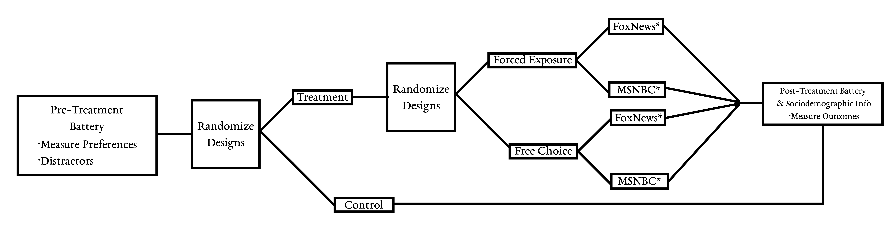

```{r setup, include=FALSE}
knitr::opts_chunk$set(echo = FALSE, warning=FALSE, message=FALSE)
```

```{r code}
## Load packages, data, analyses
source("../code/02-analysis.R")
```

\clearpage


Citizens in western democracies hold wide-ranging and systematic misperceptions about immigrants to their home countries. For example, people usually overestimate the total number of immigrants or the proportion of immigrants that are dependent on social welfare [e.g., @alesina2019immigration]. Given this extensive spread of misinformation, various studies examined how corrective information may affect people's underlying attitudes towards immigration, albeit with limited success. Although corrective information may alleviate factual misperceptions, it rarely affects people's underlying attitudes [see for example @hopkins2019muted].

A possible explanation for this apparent disconnect could be that factual information is simply irrelevant for attitude formation and---if anything---serves as a mere justification for people to rationalize their existing predispositions towards immigrant populations. However, the extent to which people engage such motivated reasoning is not without limits---as people have been shown to update their prior beliefs after reaching a "tipping point" of counter-attitudinal information [@redlawsk2010affective]. Furthermore, recent research on immigration attitudes demonstrate the persuasiveness of certain interventions such as canvassing [@kalla2020reducing].

Why do researchers frequently fail to find evidence of attitude change after providing respondents with corrective information? We argue that most experimental designs in this area are inconclusive because they omit a crucial mechanism: people's discretion over whether to engage with a given information source or not. Specifically, studies usually employ simple random assignment of informational treatments without considering people's selective exposure. Unfortunately, such a set-up does not allow us to estimate the quantity of interest that is ultimately of key interest: the effect of misinformation corrections among *people who would have chosen to access the information in the first place* [see also @benedictis2019persuading; @knox2019design].

We address these shortcomings of previous research by implementing an experimental design that varies both, the source of misinformation corrections as well as the process through which people access the information. Specifically, we conduct an online survey experiment on the effectiveness of corrective information about immigration. Depending on the experimental condition, participants are either able to freely choose--or are assigned to--an article published by different news channels (Fox News vs. MSNBC), which discusses the economic impact of legal immigration. Crucially, our design allows us to differentiate how the information treatment impacts factual beliefs, how they are interpreted, as well as broader attitudes towards immigration. The results indicate that while the correction of factual misperceptions is does not depend on media choice, subsequent attitude change is conditional on people's willingness to seek out alternative sources.

Taking into account endogenous information search in studies of misinformation corrections is crucial in our rapidly changing media environment where people have unprecedented control over their information diets [see also @iyengar2009red]. While people can access an ever-growing set of news outlets of varying quality, we only have a limited understanding how these systemic changes in information channels moderate the effectiveness of corrective information itself. Past research mostly focused on the effect of different _types_ of misinformation corrections. This study contributes to the literature by shifting the focus to the question of _how_ and _from where_ corrective information reaches people.


# Why misinformation corrections (often) fail

To the extent that people rely on inaccurate factual beliefs to form their opinions, misinformation can severely impede democratic representation by inducing collective preferences that systematically diverge from a more informed public [@kuklinski2000misinformation]. For instance, earlier studies focusing on aggregate opinion estimated that increasing individual information levels results in altered preferences of the electorate [e.g., @bartels1996uninformed; @althaus1998information]. Experimental studies examining change in individual attitudes, however, only found scant evidence for information treatments impacting peoples underlying opinions [see @flynn2017nature for an overview].

Focusing on misinformation in the context of immigration, @hopkins2019muted conducted multiple survey experiments informing participants about the size of the foreign-born population in the US---a statistic that is systematically overestimated by people in the absence of corrective information. In other words, many Americans are systematically misinformed, and this misinformation is associated with attitudes towards minority groups. Across seven separate survey experiments, the authors find that "accurate information does little to affect attitudes toward immigration, even though it does reduce the perceived size of the foreign-born population. [...] Misperceptions about the size of minority groups may be a consequence, rather than a cause, of attitudes toward those groups" [@hopkins2019muted, 315]. The authors therefore suggest that attitudes towards immigration resist change because they are grounded in more fundamental predispositions that are independent of the factual premise [see also @hainmueller2014public]. 

In sum, changing people's minds by providing corrective information is far from easy---especially when it comes to deeply held beliefs that are connected to people's identities [@nyhan2019taking]. However, this does not imply that new facts are bound to have no attitudinal consequences whatsoever. Although people engage in motivated reasoning and resist counter-attitudinal evidence [@Taber2006], there is some evidence that they are not completely immune to it [@redlawsk2010affective]. Before turning our discussion to a potential mechanism that may facilitate such attitude change, we need to begin by developing a clear conceptualization of different types of updating that may result from exposure to corrective information.


## Differentiating factual beliefs, interpretations, and opinions

Building on a framework developed in @gaines2007same, we define factual *beliefs* as assessments of the state of the world that are (at least in principle) intersubjectively observable and can therefore be either true or false. For example, the statement "Immigrant-owned businesses employed almost 8 million American workers in 2019" describes a factual belief that is objectively verifiable and--importantly--completely void of evaluative components. As we will further discuss below, it turns out that people are systematically misinformed about the number of workers employed by immigrant-owned businesses in the sense that they consistently underestimate this statistic. Corrective information in this example would simply consist of an accurate estimate, which, given previous evidence using similar designs [e.g., @hopkins2019muted], should be fairly effective in reducing (factual) misperceptions.

Incorrect factual beliefs only impede democratic representation to the extent that they affect peoples preferences [@kuklinski2000misinformation]. As such, it seems insufficient to consider the effect of misinformation corrections on factual beliefs alone. Rather, we need to examine how they influence subsequent evaluations. We define the step of adding immediate evaluative components to factual beliefs as *interpretations*. Continuing our previous example, a possible interpretation could be the following statement: "Immigrants improve the U.S. economy by creating additional jobs." This statement is still grounded in knowable facts such as the number of people employed by immigrant-owned businesses, but it contains evaluative components that are driven by implicit premises about potential economic "downsides" of immigration. Holding everything else constant, corrective information about the actual number of workers employed by immigrant-owned businesses should lead to a more positive assessment of the economic benefits of immigration. However, there is substantial leeway for people to interpret the same facts differently depending on their political predispositions [e.g., @gaines2007same].

Lastly, we define *opinions* as evaluative judgments that are formed about the state of the world, but that are not necessarily based on verifiable facts. An example for an opinion in our context would be the statement "The number of immigrants from foreign countries should be increased." Of course, this statement might be informed by objective facts about the economic impact of immigrant-owned business, but it certainly does not have to be. As such, corrective information can only be expected to have limited effects on opinions as these are largely driven by more fundamental predispositions.

How does this conceptualization of beliefs, interpretations, and opinions help us understand potential impact of corrective information? @gaines2007same uses this framework to differentiate four different types of updating as a response to a changing state of the world:

1. **Complete Updating:** \hspace{0.5em} reality $\rightarrow$ beliefs $\rightarrow$ interpretations $\rightarrow$ opinions
2. **Fact Avoidance:** \hspace{2.4em} reality **| |** beliefs $\rightarrow$ interpretations $\rightarrow$ opinions
3. **Meaning Avoidance:** \hspace{0.4em} reality $\rightarrow$ beliefs **| |** interpretations $\rightarrow$ opinions
4. **Opinion Avoidance:** \hspace{0.85em} reality $\rightarrow$ beliefs $\rightarrow$ interpretations **| |** opinions

Under complete updating, new factual information directly shapes beliefs about the state of the world, which in turn affects relevant interpretations, and ultimately results in opinion change. Consequently, incomplete updating despite new information could be due to a lack of belief updating (fact avoidance), interpretations that resist altered beliefs (meaning avoidance), or opinions driven by predispositions alone (opinion avoidance). Within this framework and considering the arguments outlined above, we can state the first hypothesis regarding the effectiveness of misinformation as follows:

> *Hypothesis 1:* Misinformation corrections have stronger effects on people's factual **beliefs** than their related **interpretations** or **opinions**.

In other words, while complete fact avoidance is relatively rare when people encounter corrective information, meaning avoidance and (especially) opinion avoidance is more common. Unfortunately, since few studies on misinformation corrections rely on an explicit distinction between these types of incomplete updating, surprisingly little is known about the determinants that make one type more likely than another. In the following section, we are going to argue that the source of corrective information is a crucial moderator in this context.


## The role of selective exposure and source credibility

Despite the fact that there is burgeoning interdisciplinary research on misinformation corrections, most experimental studies in this area rely on relatively simple designs that randomly assign different types of informational treatments to participants. While such designs have certain advantages such as straightforward causal identification, they essentially ignore a crucial aspect of our media environment: people's discretion over their individual media diet and the information they decide to access. There are notable examples of research in related areas that directly address selective exposure as part of their experimental designs---such as recent work on media hostility [@arceneaux2012polarized], persuasion [@benedictis2019persuading], and political knowledge [@leeper2020raising]. To our knowledge, however, no experimental study on misinformation corrections to date takes similar steps to account for endogenous media choice. This is surprising since individual media environments are becoming increasingly diverse and polarized [see @stroud2017selective for an overview], which makes it relatively easy for people to avoid counter-attitudinal corrective information [@guess2020exposure]. As such, prior studies do not allow us to estimate a key quantity of interest: the effect of misinformation corrections among people who would have chosen to access the information in the first place [@benedictis2019persuading].

Considering our differentiation between beliefs, interpretations, and opinions, we argue that selective exposure is a key mechanism that influences whether misinformation corrections ultimately result in complete updating, opinion avoidance, meaning avoidance, or even fact avoidance. 

News reports contain interpretations, and these interpretations are more dependent on source credibility.

> *Hypothesis 2:* Misinformation corrections have stronger effects if people are able to **choose** their information source. These differences are more pronounced for opinions and interpretations than for beliefs.

Meaning avoidance and opinion avoidance is less common if people have discretion over what information to access


- Source credibility differs by source: Notwithstanding the large existing body of literature on the importance of source cues [e.g., @goren2009source; @ladd2010role], prior studies on misinformation corrections rarely consider the potential role of source credibility.
- @dalton1998partisan: perception of news is shaped by a person's political views
- @little2019distortion: Individuals with strong partisan beliefs are more skeptical that "neutral" media reports with accuracy and believe the media as biased against their beliefs
- @kuklinski1994hearing: The idea of source credibility extends to the individual political actor; connected the use of ideological heuristics and source cues. They argued that by focusing their attention on the individual political actor, citizens make quick judgments of the information presented to them based largely on the reputation of the speaker. Experimental subjects presented with a message evaluated that message based largely on their opinion of the speaker. In this way the messenger overwhelms the message
- @lupia1998democratic: Source credibility profoundly affects social interpretations of information
- Error correction of fake news is mostly likely to be effective when coming from a co-partisan w/ whom one might expect to agree [@berinsky2017rumors].

Sources that are deemed credible are more influential than sources with low credibility. Credibility includes both expertise and trustworthiness and studies have found that source credibility impacts whether individuals will correct misinformation [@guillory2013correcting]. One would assume that non-partisan authorities would be a trusted source of information. However, in a time when partisanship colors how people perceive new information, even neutral sources might be less credible than is often presumed [see @berinsky2018telling]. 

> *Hypothesis 3:* Misinformation corrections have stronger effects if the information source is **consistent** with people's media preferences. These differences are more pronounced for opinions and interpretations than for beliefs.

Classic source cue argument: Meaning avoidance and opinion avoidance is less common if people are exposed to news organizations they prefer

But is it theoretically something different? This is ultimately an empirical question! Is choosing substantively diff than mech of friendly vs unfriendly source. Is it about control over choosing itself? Big mech is whether you trust info source or not. If it’s the same, need to rethink whether our contribution to the literature is going beyond what the source cue lit has done.

- Does the ability to **choose** always imply **consistent** exposure?
- If choice $\neq$ consistency, how do their effects differ?


# Research Design

Previous research examining the effectiveness of corrective information showed that it does not always lead to attitude change even if misperceptions are reduced [@hopkins2019muted; @thompson2019might]. However, others find that media exposure can persuade people to change their attitudes under certain conditions [e.g., @benedictis2019persuading]. Our study explores how the way people access corrective information influences the likelihood of its success in reducing misperceptions. In general, we expect that those who were able to choose a news agency are more likely to pick a source similar to their usual media diet. Additionally, we expect those who read a news story from a trusted news source (and who are able to pick the news agency) are more inclined to evaluate the article positively and change their attitudes in the direction of the news article.

## Overview

Our study builds on the Preference-Incorporating Choice and Assignment Design proposed by @benedictis2019persuading and @knox2019design. Participants are randomly assigned to a free choice treatment condition, a forced exposure treatment condition, or a control group. Participants in the free choice condition are asked to choose whether they want to see a recent breaking news tweet from either FoxNews or MSNBC. After viewing the tweet, which links to a news story focusing on immigrant-owned businesses in the US, participants are asked to read the corresponding article. In the forced exposure condition, participants do not have the option to choose a news organization (FoxNews or MSNBC), but are randomly assigned to one or the other. In either condition, the content of the news article is held constant across sources. By holding the content constant, our design has the additional advantage of more clearly differenting the effects of the choice vs assigned group by ensuring that the differences are not a result of the structure, content, or tone of different stories. Finally, participants who are randomly assigned to the control group skip the tweet and article entirely and move directly from the pre-treatment battery (questions on media usage, stereotyping, and political attitudes/behavior) to the post-treatment battery (questions on attitudes toward immigrantion and trust in different media sources). For more details on the design, see Figure 1 below as well as the full questionnaire, including all treatment conditions, in our pre-registered analysis on EGAP.



## Information Treatment

- In the following section, we are going to show you a random tweet drawn from the accounts of [two/several] large news organizations. **You can choose from which Twitter account the random tweet will be drawn.** Afterwards, we are going to ask you some questions about the content of the news story.

```{r, tweets, fig.show="hold", out.width="50%", fig.cap="Test"}
knitr::include_graphics(c("../material/tweets/fox_popular.png", "../material/tweets/msnbc_popular.png"))
```

## Measuring Belief, Interpretation, and Opinion


```{r}
tribble(
  ~Belief, ~Interpretation, ~Opinion,
  "Across the United States, how many workers--immigrant and US-born--do you think are employed by immigrant-owned businesses?",
  "On average, would you say that people who come to live here from other countries will take jobs away from people already here or add to the economy by creating additional jobs?",
  "Do you think the number of immigrants from foreign countries who are permitted to come to the United States to live should be [increased/left the same/decreased]", "", "", "",
  "Taking your best guess, what was the total amount of sales revenue of immigrant-owned businesses in the last year?",
  "Most people who come to live in the U.S. work and pay taxes. They also use health and social services. On balance, do you think people who come here take out more than they put in or put in more than they take out?",
  ""
) %>%
  knitr::kable("latex", 
               caption = "This is the table caption",
               booktabs = TRUE) %>%
  kableExtra::column_spec(1, width = "4cm") %>%
  kableExtra::column_spec(2, width = "6cm") %>%
  kableExtra::column_spec(3, width = "5cm")
```


# Results 

<!-- ## Corrective information and media choice -->

\clearpage

## Free Choice Enables Opinion Change

<!-- People Change their Minds if They are Allowed to Choose their Information Source  -->

```{r m1, fig.height=2, fig.width=7, fig.cap="\\label{fig:m1}Treatment effects of forced exposure and free choice manipulation (vs. control). Coefficients are based on linear regression models controlling for pre-treatment immigration attitudes, political predispositions, and sociodemographics. Positive coefficients indicate larger probability of correct responses (Belief) or more liberal immigration attitudes (Interpretation \\& Opinion). 95\\% confidence intervals based on robust standard errors. Full model results included in the appendix."}
p1
```

## Opinion Change is Driven by Voluntary Exposure to Inconsistent Sources

```{r m2, fig.height=3.5, fig.width=7.1, fig.cap="\\label{fig:m2}Treatment effects of forced exposure and free choice manipulation (vs. control) conditional on consistency between media preference and information source. Coefficients are based on linear regression models controlling for pre-treatment immigration attitudes, political predispositions, and sociodemographics. Positive coefficients indicate larger probability of correct responses (Belief) or more liberal immigration attitudes (Interpretation \\& Opinion). 95\\% confidence intervals based on robust standard errors. Full model results included in the appendix."}
p2
```

<!-- ## Voluntary and Involuntary Exposure to Inconsistent Sources -->

```{r m4, fig.height=2, fig.width=6.5, fig.cap="\\label{fig:m4} Difference in treatment effects of forced exposure and free choice manipulation conditional on exposure to information source that is inconsistent with media preference. Coefficients are based on linear regression models controlling for pre-treatment immigration attitudes, political predispositions, and sociodemographics. Positive coefficients indicate larger treatment effect for voluntary (vs. involuntary) exposure to inconsistent source. 95\\% confidence intervals based on robust standard errors. Full model results included in the appendix."}
p4
```


# Discussion and Conclusion

<!-- discuss future directions -->

# References
