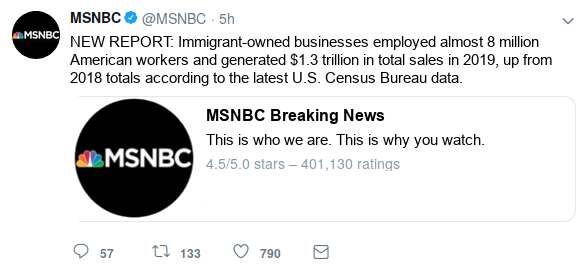
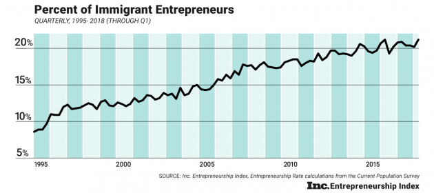

```{r setup, include=FALSE}
knitr::opts_chunk$set(echo = FALSE, warning=FALSE, message=FALSE)
options(qwraps2_markup = "markdown")
```

```{r analyses, include=FALSE}
## Load packages, data, analyses
source("../code/02-analysis.R")
library(DeclareDesign)
library(tidyverse)
library(sandwich)
library(stargazer)
library(qwraps2)
library(lmtest)
library(broom)
library(nnet)
library(car)
library(here)
library(cowplot)
```


\renewcommand\thesection{\Alph{section}}
\renewcommand\thesubsection{\Roman{subsection}}
\counterwithin{figure}{section}
\counterwithin{table}{section}

\StopCensoring

# Sample Overview

## Basic Demographics and Balance Checks

```{r balance_table, results='asis', eval = FALSE}
list(
  "Age" =
    list("Minimum"       = ~ min(age),
         "Maximum"       = ~ max(age),
         "Mean (Standard Deviation)" = ~ qwraps2::mean_sd(age)),
  "Sex" =
    list("Male"      = ~ n_perc(male == 1, na_rm = TRUE)),
  "Race" =
    list("White"     = ~ n_perc(race == "Caucasian/White (non-Hispanic)"),
         "Black or African-American"     = ~ n_perc(race == "Black or African-American (non-Hispanic)"),
         "Hispanic or Latino"  = ~ n_perc(race == "Hispanic or Latino"),
         "Other" = ~ n_perc(race %in% c("Other",
                                        "Middle Eastern",
                                        "Asian/Pacific Islanders",
                                        "Native American or Aleut"))),
  "Party Identification" =
    list("Strong Republican"     = ~ n_perc(pid_rep == 1, na_rm = TRUE),
         "Republican"            = ~ n_perc(pid_rep == 5/6, na_rm = TRUE),
         "Lean Republican"       = ~ n_perc(pid_rep == 4/6, na_rm = TRUE),
         "Independent"           = ~ n_perc(pid_rep == 3/6, na_rm = TRUE),
         "Lean Democrat"         = ~ n_perc(pid_rep == 2/6, na_rm = TRUE),
         "Democrat"              = ~ n_perc(pid_rep == 1/6, na_rm = TRUE),
         "Strong Democrat"       = ~ n_perc(pid_rep == 0, na_rm = TRUE)),
  "Ideology" =
    list("Very Conservative"     = ~ n_perc(ideol_con == 1, na_rm = TRUE),
         "Conservative"          = ~ n_perc(ideol_con == 5/6, na_rm = TRUE),
         "Slightly Conservative" = ~ n_perc(ideol_con == 4/6, na_rm = TRUE),
         "Moderate"              = ~ n_perc(ideol_con == 3/6, na_rm = TRUE),
         "Slightly Liberal"      = ~ n_perc(ideol_con == 2/6, na_rm = TRUE),
         "Liberal"               = ~ n_perc(ideol_con == 1/6, na_rm = TRUE),
         "Very Liberal"          = ~ n_perc(ideol_con == 0, na_rm = TRUE)),
  "Highest Education Level" =
    list("Post-Graduate Degree"   = ~ n_perc(educ == "Completed post-graduate or professional school, with degree"),
         "4-year Degree"     = ~ n_perc(educ == "Graduated 4-year college"),
         "2-year Degree"     = ~ n_perc(educ == "Graduated 2-year college"),
         "Some College"      = ~ n_perc(educ == "Some college but no college degree"),
         "High School"       = ~ n_perc(educ == "Graduated high school or GED"),
         "Less than High School"  = ~ n_perc(educ == "Less than a high school diploma")),
  "Income Level" =
    list("$120,000+"      = ~ n_perc(income == 1, na_rm = TRUE),
         "$119,999 - $100,000"   = ~ n_perc(income == 5/6, na_rm = TRUE),
         "$99,999 - $80,000"     = ~ n_perc(income == 4/6, na_rm = TRUE),
         "$79,999 - $60,000"     = ~ n_perc(income == 3/6, na_rm = TRUE),
         "$59,999 - $40,000"     = ~ n_perc(income == 2/6, na_rm = TRUE),
         "$39,999 - $20,000"     = ~ n_perc(income == 1/6, na_rm = TRUE),
         "< $20,000"       = ~ n_perc(income == 0, na_rm = TRUE))
) %>%
  summary_table(
    mutate(
      df,
      condition = recode_factor(condition,
                                `control` = "Control",
                                `assigned` = "Forced exposure",
                                `choice` = "Free choice")), 
    ., by = "condition")
```

```{r balance_plot, fig.height=8, fig.width=7, fig.cap="\\label{fig:demographics}Overview of sample demographics and pretreatment attitudes across experimental conditions."}
df <- df %>% mutate(
  Condition = recode_factor(condition,
                            `control` = "Control",
                            `assigned` = "Forced exposure",
                            `choice` = "Free choice"),
  Sex = recode_factor(male,
                      `0` = "Female",
                      `1` = "Male"),
  `Born in US` = recode_factor(usborn,
                               `0` = "No",
                               `1` = "Yes"),
  Race = recode_factor(race,
                       `Caucasian/White (non-Hispanic)` = "White",
                       `Black or African-American (non-Hispanic)` = "Black/\nAfrican-American",
                       `Hispanic or Latino` = "Hispanic/\nLatino",
                       `Other` = "Other",
                       `Middle Eastern` = "Other",
                       `Asian/Pacific Islanders` = "Other",
                       `Native American or Aleut` = "Other"),
  `Party Identification` = recode_factor(pid_rep * 6,
                                         `6` = "Republican",
                                         `5` = "Republican",
                                         `4` = "Independent",
                                         `3` = "Independent",
                                         `2` = "Independent",
                                         `1` = "Democrat",
                                         `0` = "Democrat"),
  Ideology = recode_factor(ideol_con * 6,
                           `6` = "Conservative",
                           `5` = "Conservative",
                           `4` = "Conservative",
                           `3` = "Moderate",
                           `2` = "Liberal",
                           `1` = "Liberal",
                           `0` = "Liberal"),
  `College Degree` = recode_factor(as.numeric(college),
                                   `0` = "No",
                                   `1` = "Yes"))

plot_grid(
  
  ggplot(df, aes(x = age, fill = Condition)) +
    geom_density(alpha=.3) +
    theme_light(base_size = 8) +
    scale_fill_brewer(palette = "Dark2") +
    labs(y = "Density", 
         x = "Age (in years)",
         title = "Age"),
  
  ggplot(df, aes(x = income * 12 + 1, fill = Condition)) +
    geom_density(alpha=.3) +
    theme_light(base_size = 8) +
    scale_fill_brewer(palette = "Dark2") +
    labs(y = "Density", 
         x = "Yearly Household Income (in $10,000)",
         title = "Income"),
  
  ggplot(df, aes(x = Condition, fill = `Born in US`)) +
    geom_bar(position = "fill") +
    theme_light(base_size = 8) +
    labs(y = "Proportion", x = "Condition", title = "Born in US") +
    theme(legend.title = element_blank()),
  
  df %>% 
    filter(!is.na(Sex)) %>% 
    ggplot(aes(x = Condition, fill = Sex)) +
    geom_bar(position = "fill") +
    theme_light(base_size = 8) +
    labs(y = "Proportion", x = "Condition", title = "Sex") +
    theme(legend.title = element_blank()),
  
  ggplot(df, aes(x = Condition, fill = `College Degree`)) +
    geom_bar(position = "fill") +
    theme_light(base_size = 8) +
    labs(y = "Proportion", x = "Condition", title = "College Degree") +
    theme(legend.title = element_blank()),
  
  ggplot(df, aes(x = Condition, fill = Race)) +
    geom_bar(position = "fill") +
    theme_light(base_size = 8) +
    labs(y = "Proportion", x = "Condition", title = "Race") +
    theme(legend.title = element_blank()),
  
  ggplot(df, aes(x = Condition, fill = Ideology)) +
    geom_bar(position = "fill") +
    theme_light(base_size = 8) +
    labs(y = "Proportion", x = "Condition", title = "Ideology") +
    theme(legend.title = element_blank()),
  
  ggplot(df, aes(x = Condition, fill = `Party Identification`)) +
    geom_bar(position = "fill") +
    theme_light(base_size = 8) +
    labs(y = "Proportion", x = "Condition", title = "Party Identification") +
    theme(legend.title = element_blank()),
  
  ggplot(df, aes(x = as.factor(problem_immigration * 4), fill = Condition)) +
    geom_bar(position = "dodge") +
    theme_light(base_size = 8) +
    scale_fill_brewer(palette = "Dark2") +
    labs(y = "Count", 
         x = "Immigration Problem",
         title = "Immigration Problem"),
  
  ggplot(df, aes(x = lazy_hispanics, fill = Condition)) +
    geom_bar(position = "dodge") +
    theme_light(base_size = 8) +
    scale_fill_brewer(palette = "Dark2") +
    scale_x_continuous(breaks = c(0,.5,1)) +
    labs(y = "Count", 
         x = "Racial Prejudice",
         title = "Racial Prejudice"),
  
  ncol = 2
)
```

```{r balance_reg, results='hide'}
m_balance <- multinom(Condition ~ age + income + usborn + male + college + white + 
                        ideol_con + pid_rep + problem_immigration + lazy_hispanics, 
                      data = df)
```

```{r balance_tab, results='asis'}
stargazer(m_balance,
          dep.var.caption = "",
          covariate.labels = c("Age", "Income", 
                               "Born in US", "Male", 
                               "College", "White", 
                               "Ideology", "Party Identification", 
                               "Immigration Problem", "Racial Prejudice", 
                               "Constant"),
          column.sep.width = "0pt", 
          title = "Balance checks for assignment to each treatment condition (vs. control group as reference category). Coefficients are based on multinomial logit model. Positive coefficients indicate larger probability of treatment assignment. Standard errors in parentheses.", 
          table.placement = "ht",
          label = "tab:balance",
          font.size = "footnotesize",
          header = FALSE,
          no.space = TRUE,
          star.cutoffs = c(.05,.01,.001))
```


\clearpage

## Media Preferences and Source Consistency

```{r preference, fig.height=3, fig.width=3.85, fig.cap="\\label{fig:media_preferences}Sample overview of media preference for Fox News vs. MSNBC."}
df %>%
  filter(!is.na(prefer)) %>%
  mutate(Preference = recode_factor(prefer,
                                    `fox` = "Fox",
                                    `neutral` = "Neither",
                                    `msnbc` = "MSNBC",
                                    .ordered = TRUE)) %>%
ggplot(aes(x = Preference)) + 
  geom_bar(position = position_dodge()) +
  theme_light(base_size = 10) +
  labs(y = "Number of observations", 
       x = "Media preference")
```

```{r consistency, fig.height=3, fig.width=5, fig.cap="\\label{fig:source_consistency}Source consistency in forced exposure vs. free choice condition."}
df %>%
  filter(!is.na(exposure),
         exposure != "control") %>%
  mutate(condition = recode_factor(condition,
                                   `assigned` = "Forced exposure",
                                   `choice` = "Free choice"),
         exposure = recode_factor(exposure,
                                  `inconsistent` = "Inconsistent",
                                  `neutral` = "Neutral",
                                  `consistent` = "Consistent")) %>%
ggplot(aes(fill = exposure, x = condition)) + 
  geom_bar(position = position_dodge()) +
  theme_light(base_size = 10) +
  labs(y = "Number of observations", fill = "Media\nexpsoure",
       x = "Experimental condition") +
  scale_fill_brewer(palette = "Dark2")
```


\clearpage

## Determinants of Choosing Fox News

```{r foxplot, fig.height=3, fig.width=7, fig.cap="\\label{fig:foxplot}Determinants of choosing Fox News in the free choice condition."}
df %>%
  filter(condition == "choice") %>%
  mutate(prefer_fox = tv_fox - tv_msnbc,
         choose_fox = as.numeric(tweet == "fox")) %>%
  dplyr::select(choose_fox, ideol_con, pid_rep, prefer_fox) %>%
  gather(variable, value, -choose_fox) %>%
  ggplot(aes(x=value, y = choose_fox)) +
  geom_jitter(alpha = .1, height = .1) + 
  geom_smooth(method = "lm") +
  facet_grid(~variable, scales = "free_x", 
             labeller = labeller(variable = c(
               ideol_con = "Ideology", 
               pid_rep = "Party Identification", 
               prefer_fox = "Fox vs. MSNBC Media Diet"))) +
  theme_light(base_size = 10) +
  labs(y = "Choose Fox News", x = "") +
  scale_y_continuous(breaks=c(0,1))
```

```{r foxtable, results='asis'}
df$choose_fox <- as.numeric(df$tweet == "fox")
df$prefer_fox <- df$tv_fox - df$tv_msnbc

list(
  fox1 = lm(choose_fox ~ ideol_con + age + male + white + college, 
            data = filter(df, condition == "choice")),
  fox2 = lm(choose_fox ~ pid_rep + age + male + white + college, 
            data = filter(df, condition == "choice")),
  fox3 = lm(choose_fox ~ prefer_fox + age + male + white + college, 
            data = filter(df, condition == "choice"))
) %>% 
  stargazer(
    dep.var.caption = "",
    dep.var.labels = "Choose Fox News", 
    covariate.labels = c("Ideology", "Party Identification", "Fox vs. MSNBC Media Diet",
                         "Age", "Male", "White", "College", 
                         "Constant"),
    column.sep.width = "0pt", 
    title = "Determinants of choosing Fox News in the free choice condition. Coefficients are based on linear regression models. Positive coefficients indicate larger probability of to choose Fox News rather than MSNBC. Standard errors in parentheses.", 
    table.placement = "ht",
    label = "tab:fox",
    font.size = "footnotesize",
    header = FALSE,
    no.space = TRUE,
    keep.stat = c("n", "rsq"),
    star.cutoffs = c(.05,.01,.001))
```


\clearpage

## Article Evaluation Conditional on Source and Media Preference

We asked participants to evaluate the news article on various dimensions such as "accurate vs. inaccurate" or "good vs. bad" (see Appendix D.I for question wording). Figure \ref{fig:article_eval} displays these average evaluations conditional on the respondents' media preferences and whether the source was Fox or MSNBC. The response patterns suggest that participants viewed the article more favorably if it was published by their preferred news network. We interpret this finding as evidence that they viewed the source attribution as believable. In other words, the fact that media preferences (and presumably differences in perceived source credibility etc.) result in diverging evaluations of the same content suggests that attributing the article to MSNBC or Fox News was a credible signal. This conclusion is further corroborated by the comparison of Average Choice-Specific Treatment Effects discussed in Appendix B.I.

```{r, fig.width=6, fig.height=6, fig.cap="\\label{fig:article_eval}Average article evaluation conditional on participants' media preference and whether the source was Fox or MSNBC."}
df %>% 
  filter(tweet != "control") %>% 
  select(wp_accurate, wp_fair, wp_balanced,
         wp_good, wp_friendly, wp_american,
         actions_discuss, actions_forward, 
         actions_post, actions_seek,
         tweet, prefer) %>% 
  pivot_longer(starts_with("wp_")) %>% 
  group_by(tweet, prefer, name) %>% 
  summarize(Average = mean(value, na.rm = TRUE),
            n = n(),
            sd = sd(value, na.rm = TRUE),
            se = sd/sqrt(n),
            cilo90 = Average-1.68*se,
            cihi90 = Average+1.68*se,
            cilo95 = Average-1.96*se,
            cihi95 = Average+1.96*se) %>% 
  na.omit() %>% 
  mutate(outcome = recode_factor(name, 
                                 `wp_accurate` = "Accurate",
                                 `wp_good` = "Good",
                                 `wp_fair` = "Fair",
                                 `wp_balanced` = "Balanced",
                                 `wp_friendly` = "Friendly",
                                 `wp_american` = "American",
                                 .ordered = TRUE),
         `Media Preference` = recode_factor(prefer,
                                            `fox` = "Fox",
                                            `neutral` = "Neither",
                                            `msnbc` = "MSNBC",
                                            .ordered = TRUE),
         Source = recode_factor(tweet,
                                  `fox` = "Fox",
                                  `msnbc` = "MSNBC")) %>% 
  ggplot(aes(y = Average, x = `Media Preference`, col = Source, group = Source)) +
  geom_line() +
  geom_linerange(aes(x = `Media Preference`, ymin = cilo95, ymax = cihi95), 
                 position = position_dodge(width = .1), 
                 size = .75) +
  geom_linerange(aes(x = `Media Preference`, ymin = cilo90, ymax = cihi90), 
                 position = position_dodge(width = .1), 
                 size = 1.5) +
  facet_wrap(.~outcome, ncol = 2) + 
  theme_light(base_size = 10)
```


\clearpage

# Additional Analyses

## Average Choice-Specifc Treatment Effects (ACTEs)

In addition to the analyses reported in the main text, we explore average choice-specific treatment effects (ACTEs) following @knox2019design and @benedictis2019persuading. In the context of our design, the ACTE describes the average effects of reading the article from Fox News instead of MSNBC among those who would usually prefer to read Fox News, MSNBC, or neither. A negative coefficient indicates that the expected value of the respective outcome measure is smaller among participants who were assigned to Fox News than among participants who were assigned to MSNBC. As such, the results in Figure \ref{fig:m4} suggest that people who usually prefer MSNBC evaluated the Fox News article less positively and were less likely to share it with others than the MSNBC article---despite the fact that the content itself was held constant across news outlets.

```{r m5, fig.height=2, fig.width=7, fig.cap="\\label{fig:m3}Average choice-specific treatment effects comparing the effect of exposure to Fox vs. MSNBC in forced choice condition conditional on media preferences on beliefs, interpretations, and opinions."}
df_assigned <- df %>%
  filter(condition == "assigned") %>%
  split(.$prefer)

extractDiff <- function(formula, data){
  tmp95 <- t.test(as.formula(formula), data=data)
  tmp90 <- t.test(as.formula(formula), data=data, conf.level = .9)
  tibble(comparison = tmp95$data.name,
         diff = diff(rev(tmp95$estimate)),
         cilo95 = tmp95$conf.int[1],
         cihi95 = tmp95$conf.int[2],
         cilo90 = tmp90$conf.int[1],
         cihi90 = tmp90$conf.int[2])
}


m5 <- bind_rows(
  map_dfr(df_assigned, ~extractDiff(employ_correct~tweet, .), .id = "prefer"),
  map_dfr(df_assigned, ~extractDiff(sales_correct~tweet, .), .id = "prefer"),
  map_dfr(df_assigned, ~extractDiff(jobs_pos~tweet, .), .id = "prefer"),
  map_dfr(df_assigned, ~extractDiff(taxes_pos~tweet, .), .id = "prefer"),
  map_dfr(df_assigned, ~extractDiff(immig_increased~tweet, .), .id = "prefer")
) %>% 
  mutate(Preference = recode_factor(prefer,
                                    `fox` = "Fox",
                                    `neutral` = "Neither",
                                    `msnbc` = "MSNBC",
                                    .ordered = TRUE),
         comparison = gsub(" by tweet", "", comparison),
         group = recode_factor(comparison, 
                               `employ_correct` = "Belief",
                               `sales_correct` = "Belief",
                               `jobs_pos` = "Interpretation",
                               `taxes_pos` = "Interpretation",
                               `immig_increased` = "Opinion",
                               .ordered = TRUE),
         outcome = recode_factor(comparison, 
                                 `employ_correct` = "Employment\ncorrect",
                                 `sales_correct` = "Sales\ncorrect",
                                 `jobs_pos` = "Immigrants\ncreate jobs",
                                 `taxes_pos` = "Immigrants\npay taxes",
                                 `immig_increased` = "Immigration\nshould be increased",
                                 .ordered = TRUE))

p5 <- ggplot(m5, aes(y = diff, x = outcome,
               shape = Preference, col = Preference)) + 
  geom_hline(yintercept = 0, col = "grey") +
  geom_point(size = 3, position=position_dodge(width=0.4)) +
  geom_linerange(aes(ymin = cilo95, ymax = cihi95), size=.75, position=position_dodge(width=0.4)) +
  geom_linerange(aes(ymin = cilo90, ymax = cihi90), size=1.5, position=position_dodge(width=0.4)) +
  theme_light(base_size = 10) + 
  labs(x = NULL, y = "Treatment effect of reading\nFox rather than MSNBC",
       col = "Media\npreference",
       shape = "Media\npreference") +
  facet_wrap(~group, scales = "free_x", ncol=3) +
  scale_color_brewer(palette = "Dark2")
p5
```

```{r m6, fig.height=2.7, fig.width=7, fig.cap="\\label{fig:m4}Average choice-specific treatment effects comparing the effect of exposure to Fox vs. MSNBC in forced choice condition conditional on media preferences on article evaluations and subsequent engagement."}
m6 <- bind_rows(
  map_dfr(df_assigned, ~extractDiff(wp_accurate~tweet, .), .id = "prefer"),
  map_dfr(df_assigned, ~extractDiff(wp_fair~tweet, .), .id = "prefer"),
  map_dfr(df_assigned, ~extractDiff(wp_balanced~tweet, .), .id = "prefer"),
  map_dfr(df_assigned, ~extractDiff(wp_good~tweet, .), .id = "prefer"),
  map_dfr(df_assigned, ~extractDiff(wp_friendly~tweet, .), .id = "prefer"),
  map_dfr(df_assigned, ~extractDiff(wp_american~tweet, .), .id = "prefer"),
  map_dfr(df_assigned, ~extractDiff(actions_seek~tweet, .), .id = "prefer"),
  map_dfr(df_assigned, ~extractDiff(actions_discuss~tweet, .), .id = "prefer"),
  map_dfr(df_assigned, ~extractDiff(actions_forward~tweet, .), .id = "prefer"),
  map_dfr(df_assigned, ~extractDiff(actions_post~tweet, .), .id = "prefer")
) %>% 
  mutate(Preference = recode_factor(prefer,
                                    `fox` = "Fox",
                                    `neutral` = "Neither",
                                    `msnbc` = "MSNBC",
                                    .ordered = TRUE),
         comparison = gsub(" by tweet", "", comparison),
         group = recode_factor(comparison, 
                               `wp_balanced` = "Article evaluation",
                               `wp_accurate` = "Article evaluation",
                               `wp_fair` = "Article evaluation",
                               `wp_good` = "Article evaluation",
                               `wp_friendly` = "Article evaluation",
                               `wp_american` = "Article evaluation",
                               `actions_seek` = "Subsequent engagement",
                               `actions_discuss` = "Subsequent engagement",
                               `actions_forward` = "Subsequent engagement",
                               `actions_post` = "Subsequent engagement",
                               .ordered = TRUE),
         outcome = recode_factor(comparison, 
                                 `wp_balanced` = "Balanced",
                                 `wp_accurate` = "Accurate",
                                 `wp_fair` = "Fair",
                                 `wp_good` = "Good",
                                 `wp_friendly` = "Friendly",
                                 `wp_american` = "American",
                                 `actions_seek` = "Seek\nmore info",
                                 `actions_discuss` = "Discuss\nwith friends",
                                 `actions_forward` = "Forward\nvia email",
                                 `actions_post` = "Post on\nsocial media",
                                 .ordered = TRUE))

p6 <- ggplot(m6, aes(y = diff, x = outcome,
             shape = Preference, col = Preference)) + 
  geom_hline(yintercept = 0, col = "grey") +
  geom_point(size = 3, position=position_dodge(width=0.6)) +
  geom_linerange(aes(ymin = cilo95, ymax = cihi95), size=.75, position=position_dodge(width=0.6)) +
  geom_linerange(aes(ymin = cilo90, ymax = cihi90), size=1.5, position=position_dodge(width=0.6)) +
  theme_light(base_size = 10) + 
  labs(x = NULL, y = "Treatment effect of reading\nFox rather than MSNBC",
       col = "Media\npreference",
       shape = "Media\npreference") +
  facet_wrap(~group, scales = "free_x", ncol=3) +
  scale_color_brewer(palette = "Dark2") +
  theme(axis.text.x = element_text(angle = 45, hjust = 1))
p6
```

```{r m7, eval=FALSE}
m7 <- list(wp_balanced = lm(wp_balanced ~ condition
                            + lazy_hispanics + problem_immigration + ideol_con + pid_rep
                            + age + male + usborn + white + college
                            , data = df),
           wp_accurate = lm(wp_accurate ~ condition
                            + lazy_hispanics + problem_immigration + ideol_con + pid_rep
                            + age + male + usborn + white + college
                            , data = df),
           wp_fair = lm(wp_fair ~ condition
                        + lazy_hispanics + problem_immigration + ideol_con + pid_rep
                        + age + male + usborn + white + college
                        , data = df),
           wp_good = lm(wp_good ~ condition
                        + lazy_hispanics + problem_immigration + ideol_con + pid_rep
                        + age + male + usborn + white + college
                        , data = df),
           wp_friendly = lm(wp_friendly ~ condition
                            + lazy_hispanics + problem_immigration + ideol_con + pid_rep
                            + age + male + usborn + white + college
                            , data = df),
           wp_american = lm(wp_american ~ condition
                            + lazy_hispanics + problem_immigration + ideol_con + pid_rep
                            + age + male + usborn + white + college
                            , data = df),
           actions_seek = lm(actions_seek ~ condition
                             + lazy_hispanics + problem_immigration + ideol_con + pid_rep
                             + age + male + usborn + white + college
                             , data = df),
           actions_discuss = lm(actions_discuss ~ condition
                                + lazy_hispanics + problem_immigration + ideol_con + pid_rep
                                + age + male + usborn + white + college
                                , data = df),
           actions_forward = lm(actions_forward ~ condition
                                + lazy_hispanics + problem_immigration + ideol_con + pid_rep
                                + age + male + usborn + white + college
                                , data = df),
           actions_post = lm(actions_post ~ condition
                             + lazy_hispanics + problem_immigration + ideol_con + pid_rep
                             + age + male + usborn + white + college
                             , data = df),
           tweet_click = lm(tweet_click ~ condition
                             + lazy_hispanics + problem_immigration + ideol_con + pid_rep
                             + age + male + usborn + white + college
                             , data = df),
           tweet_time = lm(log(tweet_time) ~ condition
                            + lazy_hispanics + problem_immigration + ideol_con + pid_rep
                            + age + male + usborn + white + college
                            , data = df),
           story_time = lm(log(story_time) ~ condition
                            + lazy_hispanics + problem_immigration + ideol_con + pid_rep
                            + age + male + usborn + white + college
                            , data = df)) %>%
  map(~coeftest(., vcov. = vcovHC(.)))
```


\clearpage

## Classification Accuracy based on Open-Ended Responses

The last analysis in the main text uses the well-established LIWC dictionary [@tausczik2010psychological; @pennebaker2015development] to examine differences in tentative language in two open-ended responses where participants explain their previous assessment of the immigrant community's contribution to society by creating jobs and paying taxes. The goal was to investigate whether the observed opinion change in response to voluntary exposure to inconsistent sources could be explained by the fact that people who decide to access inconsistent sources have more ambivalent immigration attitudes prior to receiving the treatment. Our analysis in the main text suggests that this is unlikely to be the case since there are no significant differences in tentative language between the forced exposure and free choice treatments (conditional on exposure to an inconsistent source).

Here, we replicate an equivalent null result using an alternative approach. Instead of relying on a predefined dictionary, we build on the methodology proposed by @Peterson2018classification and use the predictive accuracy of machine learning classifiers as a measure of "tentative" language. Specifically, we train a Naive Bayes classifier that predicts whether participants report pro- or anti-immigrant closed-ended attitudes based on their open-ended responses explaining their respective answer. The underlying reasoning is that it should be harder for the classifier to predict people's responses if they have ambivalent attitudes since they use tentative language and hedging instead of clear pro/con statements.

Our training set consists of all open-ended responses of participants in the control condition as well as those who were exposed to a consistent media source (or reported no clear preference for Fox News or MSNBC). Accordingly, the test set consists of all remaining open-ended responses of participants who were exposed to a source that was inconsistent with their media preferences (about 12% of the sample). We chose this particular split of training and test set in order to maximize the performance of our classifier and since we are ultimately only interested in evaluating the out-of-sample classification accuracy among respondents who were exposed to inconsistent sources.

The results of this comparison between voluntary and involuntary exposure to inconsistent sources are displayed in Figure \ref{fig:m6}. Higher predictive accuracy implies more concrete language and therefore less ambivalent attitudes. While the overall out-of-sample performance of the classifier is high (i.e., we are able to predict closed-ended attitudes based on open-ended responses), we find no evidence for increased ambivalence among participants in the free choice condition who accessed inconsistent sources voluntarily as compared to those who were forced to do so.

```{r m8, fig.height=2, fig.width=4.5, fig.cap="\\label{fig:m6}Accuracy of Naive Bayes classifier to predict immigration attitudes in closed-ended responses based on the participants' language in open-ended responses explaining their initial answer. Comparison focuses on respondents who were exposed to a source that is inconsistent with their media preference."}
source("../code/04-predictive_accuracy.R")
p8
```


\clearpage

## Replicating Linear Probability Models using Logistic Regression

```{r m1logit, results='asis'}
stargazer(m1logit, 
          dep.var.caption = "",
          dep.var.labels = c("Employment", "Sales"), 
          covariate.labels = c("Forced Exposure", "Free Choice", 
                               "Racial Prejudice", "Immigration Problem", 
                               "Ideology", "Party Identification", 
                               "Age", "Male", "Born in US", "White", "College", 
                               "Constant"),
          column.labels = "Belief",
          column.separate = 2,
          column.sep.width = "0pt", 
          title = "Treatment effects of forced exposure and free choice manipulation (vs. control). Replication of linear probability models reported in Figure 3 (main text) and Table \\ref{tab:m1} (Appendix) using logistic regression. Positive coefficients indicate larger probability of correct responses. Standard errors in parentheses.", 
          table.placement = "ht",
          label = "tab:m1logit",
          font.size = "footnotesize",
          header = FALSE,
          no.space = TRUE,
          star.cutoffs = c(.05,.01,.001))
```

```{r m2logit, results='asis'}
stargazer(m2logit, 
          dep.var.caption = "",
          dep.var.labels = c("Employment", "Sales"), 
          covariate.labels = c("Inconsistent", "Neutral", "Consistent", 
                               "Racial Prejudice", "Immigration Problem", 
                               "Ideology", "Party Identification", 
                               "Age", "Male", "Born in US", "White", "College", 
                               "Constant"),
          column.labels = "Belief",
          column.separate = 2,
          column.sep.width = "0pt", 
          title = "Treatment effects of consistent/neutral/inconsistent information source (vs. control) in forced exposure  condition. Replication of linear probability models reported in Figure 4 (main text) and Table \\ref{tab:m2} (Appendix) using logistic regression. Positive coefficients indicate larger probability of correct responses. Standard errors in parentheses.", 
          table.placement = "ht",
          label = "tab:m2logit",
          font.size = "footnotesize",
          header = FALSE,
          no.space = TRUE,
          keep.stat = c("n", "rsq"),
          star.cutoffs = c(.05,.01,.001))
```

```{r m3logit, results='asis'}
stargazer(m3logit, 
          dep.var.caption = "",
          dep.var.labels = c("Employment", "Sales"), 
          covariate.labels = c("Inconsistent", "Neutral", "Consistent", 
                               "Racial Prejudice", "Immigration Problem", 
                               "Ideology", "Party Identification", 
                               "Age", "Male", "Born in US", "White", "College", 
                               "Constant"),
          column.labels = "Belief",
          column.separate = 2,
          column.sep.width = "0pt", 
          title = "Treatment effects of consistent/neutral/inconsistent information source (vs. control) in free choice condition. Replication of linear probability models reported in Figure 4 (main text) and Table \\ref{tab:m3} (Appendix) using logistic regression. Positive coefficients indicate larger probability of correct responses. Standard errors in parentheses.", 
          table.placement = "ht",
          label = "tab:m3logit",
          font.size = "footnotesize",
          header = FALSE,
          no.space = TRUE,
          keep.stat = c("n", "rsq"),
          star.cutoffs = c(.05,.01,.001))
```

```{r m4logit, results='asis'}
stargazer(m4logit, 
          dep.var.caption = "",
          dep.var.labels = c("Employment", "Sales"), 
          covariate.labels = c("Free Choice", 
                               "Racial Prejudice", "Immigration Problem", 
                               "Ideology", "Party Identification", 
                               "Age", "Male", "Born in US", "White", "College", 
                               "Constant"),
          column.labels = "Belief",
          column.separate = 2,
          column.sep.width = "0pt", 
          title = "Difference in treatment effects of free choice manipulation (vs. forced exposure) conditional on exposure to information source that is inconsistent with media preference. Replication of linear probability models reported in Figure 5 (main text) and Table \\ref{tab:m4} (Appendix) using logistic regression. Positive coefficients indicate larger treatment effect for voluntary (vs. involuntary) exposure to inconsistent source. Standard errors in parentheses.", 
          table.placement = "ht",
          label = "tab:m4logit",
          font.size = "footnotesize",
          header = FALSE,
          no.space = TRUE,
          keep.stat = c("n", "rsq"),
          star.cutoffs = c(.05,.01,.001))
```


\clearpage\singlespace


# Regression Tables for Models Reported in Main Text

```{r m1, results='asis'}
stargazer(m1, 
          dep.var.caption = "",
          dep.var.labels = c("Employment", "Sales", "Jobs",
                             "Taxes", "Immigration"), 
          covariate.labels = c("Forced Exposure", "Free Choice", 
                               "Racial Prejudice", "Immigration Problem", 
                               "Ideology", "Party Identification", 
                               "Age", "Male", "Born in US", "White", "College", 
                               "Constant"),
          column.labels = c("Belief", "Interpretation", "Opinion"),
          column.separate = c(2,2,1),
          column.sep.width = "0pt", 
          title = "Treatment effects of forced exposure and free choice manipulation (vs. control). Coefficients are based on linear regression models. Positive coefficients indicate larger probability of correct responses (Belief) or more liberal immigration attitudes (Interpretation \\& Opinion). Standard errors in parentheses. Coefficients are used for Figure 3 in the main text.", 
          table.placement = "ht",
          label = "tab:m1",
          font.size = "footnotesize",
          header = FALSE,
          no.space = TRUE,
          keep.stat = c("n", "rsq"),
          star.cutoffs = c(.05,.01,.001))
```

```{r m2, results='asis'}
stargazer(m2, 
          dep.var.caption = "",
          dep.var.labels = c("Employment", "Sales", "Jobs",
                             "Taxes", "Immigration"), 
          covariate.labels = c("Inconsistent", "Neutral", "Consistent", 
                               "Racial Prejudice", "Immigration Problem", 
                               "Ideology", "Party Identification", 
                               "Age", "Male", "Born in US", "White", "College", 
                               "Constant"),
          column.labels = c("Belief", "Interpretation", "Opinion"),
          column.separate = c(2,2,1),
          column.sep.width = "0pt", 
          title = "Treatment effects of consistent/neutral/inconsistent information source (vs. control) in forced exposure  condition. Coefficients are based on linear regression models. Positive coefficients indicate larger probability of correct responses (Belief) or more liberal immigration attitudes (Interpretation \\& Opinion). Standard errors in parentheses. Coefficients are used for Figure 4 in the main text.", 
          table.placement = "ht",
          label = "tab:m2",
          font.size = "footnotesize",
          header = FALSE,
          no.space = TRUE,
          keep.stat = c("n", "rsq"),
          star.cutoffs = c(.05,.01,.001))
```

```{r m3, results='asis'}
stargazer(m3, 
          dep.var.caption = "",
          dep.var.labels = c("Employment", "Sales", "Jobs",
                             "Taxes", "Immigration"), 
          covariate.labels = c("Inconsistent", "Neutral", "Consistent", 
                               "Racial Prejudice", "Immigration Problem", 
                               "Ideology", "Party Identification", 
                               "Age", "Male", "Born in US", "White", "College", 
                               "Constant"),
          column.labels = c("Belief", "Interpretation", "Opinion"),
          column.separate = c(2,2,1),
          column.sep.width = "0pt", 
          title = "Treatment effects of consistent/neutral/inconsistent information source (vs. control) in free choice condition. Coefficients are based on linear regression models. Positive coefficients indicate larger probability of correct responses (Belief) or more liberal immigration attitudes (Interpretation \\& Opinion). Standard errors in parentheses. Coefficients are used for Figure 4 in the main text.", 
          table.placement = "ht",
          label = "tab:m3",
          font.size = "footnotesize",
          header = FALSE,
          no.space = TRUE,
          keep.stat = c("n", "rsq"),
          star.cutoffs = c(.05,.01,.001))
```

```{r m4, results='asis'}
stargazer(m4, 
          dep.var.caption = "",
          dep.var.labels = c("Employment", "Sales", "Jobs",
                             "Taxes", "Immigration"), 
          covariate.labels = c("Free Choice", 
                               "Racial Prejudice", "Immigration Problem", 
                               "Ideology", "Party Identification", 
                               "Age", "Male", "Born in US", "White", "College", 
                               "Constant"),
          column.labels = c("Belief", "Interpretation", "Opinion"),
          column.separate = c(2,2,1),
          column.sep.width = "0pt", 
          title = "Difference in treatment effects of free choice manipulation (vs. forced exposure) conditional on exposure to information source that is inconsistent with media preference. Coefficients are based on linear regression models. Positive coefficients indicate larger treatment effect for voluntary (vs. involuntary) exposure to inconsistent source. Standard errors in parentheses. Coefficients are used for Figure 5 in the main text.", 
          table.placement = "ht",
          label = "tab:m4",
          font.size = "footnotesize",
          header = FALSE,
          no.space = TRUE,
          keep.stat = c("n", "rsq"),
          star.cutoffs = c(.05,.01,.001))
```


\clearpage\singlespace

# Full Questionnaire

## Pretreatment Measures

**Block 1: Media usage**

First, we want to ask a few questions about your current media diet.

**[smedia]** *(show same response options for each, randomize order)* On average, how often do you use the following social media platforms?

- YouTube
- Facebook
- Instagram
- Twitter
- Tumblr

1. Several times a day
2. About once a day
3. 3 to 6 days a week
4. 1 to 2 days a week
5. Every few weeks
6. Less often
7. Never
8. Don’t Know

**[tv]** *(show same response options for each, randomize order)* On average, how often do you watch _political_ news on the following TV channels (including online content)?

- Fox News
- MSNBC
- CNN
- NBC
- CBS

1. Several times a day
2. About once a day
3. 3 to 6 days a week
4. 1 to 2 days a week
5. Every few weeks
6. Less often
7. Never
8. Don’t Know

**[print]** *(show same response options for each, randomize order)* And how often do you read about articles about _politics_ in the following newspapers (online or offline)?

- New York Times
- Washington Post
- Wall Street Journal
- USA Today
- New York Post

1. Several times a day
2. About once a day
3. 3 to 6 days a week
4. 1 to 2 days a week
5. Every few weeks
6. Less often
7. Never
8. Don’t Know

\vspace{1em}

**Block 2: Stereotype battery**

Next are some questions about different groups in our society.

**[st_job]** *(show same response options for each, randomize order)* Do you think that people in the following groups tend to be "intelligent" or "unintelligent"?

- Farmers
- Teachers
- Lawyers
- Politicians

(1) Intelligent - (7) Unintelligent, (8) DK

**[st_race]** *(show same response options for each, randomize order)* And do you think that people in the following groups are "hard-working" or "lazy"?

- Whites
- Blacks
- Hispanic-Americans
- Asian-Americans

(1) Hard-working - (7) Lazy, (8) DK

**[st_age]** *(show same response options for each)* And do you think that people in the following groups are "generous" or "selfish"?

- Silent Generation (born 1945 and before)
- Baby Boomers (born 1946-1964)
- Generation X (born 1965-1976)
- Millennials (born 1977-1995)

(1) Generous - (7) Selfish, (8) DK

\vspace{1em}

**Block 3: Political attitudes & participation**

Next, we would like you to answer a few questions about your political viewpoints.

**[polint]** How often do you pay attention to what's going on in government and politics?

1. Always
2. Most of the time
3. Sometimes
4. Hardly at all
5. Never

**[problem]** *(randomize order)* What do you think are the most important problems facing this country? Please rank the following issues from the most important to the least important.

1. Economy
2. Terrorism
3. Immigration
4. Health Care
5. Environment

**[ideol]** Thinking about politics these days, how would you describe your own political viewpoint?

1. Very liberal
2. Liberal
3. Slightly liberal
4. Moderate
5. Slightly conservative
6. Conservative
7. Very conservative
8. Not sure

**[pid]** Generally speaking, do you think of yourself as a Republican, a Democrat, an independent, or other?

1. Republican
2. Democrat
3. Independent
4. Other

**[pid_lean]** *(if `[pid] == other | independent`)*
Do you think of yourself as CLOSER to the Republican party or to the Democratic party?

1. Republican party
2. Democratic party
3. Neither party

**[pid_rep/pid_dem]** *(if `[pid] == Republican | Democrat`)*
Would you consider yourself a strong Republican/Democrat or a not very strong Republican/Democrat?

1. Strong
2. Not very strong

## Information Treatment

**Tweets**

**[choice]** *(if `condition == choice`, randomize order)* In the following section, we are going to show you a random tweet drawn from the accounts of two large news organizations. You can choose from which Twitter account the random tweet will be drawn. Afterwards, we are going to ask you some questions about the content of the news story.

From which Twitter account would you like to view a random tweet?
        
1. Fox News
2. MSNBC

**[assigned]** *(if `condition == assigned`, assignment to Twitter account invisible to participant)* In the following section, we are going to show you a random tweet drawn from the accounts of several large news organizations. Afterwards, we are going to ask you some questions about the content of the news story.

**[tweet]** *(show one of the following images, depending on `[choice]` or `[assigned]`)*

{width=50%}
{width=50%}

Next, we will show you the content of the article linked in the previous tweet. **Please read the story carefully.** Keep in mind that we will ask you questions about the content of the article afterwards.

_There will be a brief pause on the next screen so you can read the story._ At the end of the pause, an arrow will appear at the bottom of the screen. Once the arrow appears, you may move on to the next screen of the survey by clicking on the arrow.

\vspace{1em}

**Full Story: Immigrant-owned Businesses on the Rise**

William Hall | [Fox News/MSNBC]

A recent report released using U.S. Census Bureau data states that immigrant-owned businesses employed over 8 million workers in fiscal year 2019, up from 2018 totals. These businesses also experienced an increase in the total amount of sales revenue, which rose to almost $1.3 trillion during the same period.

These statistics are borne out of hundreds of success stories across many different sectors of the economy, especially the service industry.

{width=45%}

Eduardo Rodriguez, a 62 year old immigrant living in the Little Village neighborhood of Chicago, is a perfect example of this success. In an area of the city that has an unemployment rate of 13 percent and an annual median income of $30,000--less than half of the national average--the Little Village community faces considerable economic challenges. However, these conditions have not stopped Rodriguez.  He currently owns and operates four Dulcelandia stores in Little Village, each one packed with over 1,000 types of delicious candies from his home country of Mexico.

After immigrating here in 1966, Rodriguez opened his first store and it became an instant gathering spot in the neighborhood. "People seem to really like what we are doing, and I'm grateful that I had the opportunity to do this in the United States. It takes a lot of work and sacrifice -- we're fulfilling a niche market that people really want to buy from."

Following in her father's footsteps, Rodriguez's daughter, Eve Rodriguez Montoya, has also opened up a handful of shops that specialize in healthy frozen yogurts with some Mexican-inspired flavors.

"Our community is very strong and hard-working -- resilient and resourceful," she said. "I'd say come to our community, get to know our people. Shop at our locations and see for yourself -- Little Village is full of people who came to this country to achieve the American Dream."

The Rodriguez's story is just one of many. As more immigrants look to open their own businesses and employ more workers, many markets, both broad and niche, will continue to expand and provide more fuel to an already strong economy.

*William Hall is a Business Reporter for [Fox News/MSNBC].*

\vspace{1em}

**Attention checks & article evaluation**

Please answer the following questions about the tweet as well as the article you just read.

**[source]** *(randomize order)*  Which Twitter account / news organization published the story?

1. Fox News
2. MSNBC
3. New York Times
4. Wall Street Journal
5. Other
6. Don't know

**[about]** *(randomize order)* Broadly speaking, what was the news story about?

1. Immigrant-owned businesses
2. Stock market development
3. Innovation in the automotive industry
4. Young entrepreneurs in Silicon Valley
5. Don't know

**[actions]** Thinking about the news article you just read, how likely would you be to:

- Discuss the story with a friend
- Forward the story to a friend or colleague via email
- Post a link to the story on a social networking site, such as Facebook or Twitter
- Seek out additional information from another source on the topic featured in the story

(1) Very likely - (4) Not likely, (7) Not sure

**[wordpairs]** *(randomize order)* Below, you will find a list of pairs of words. Please rate the news article you just read on each of the pairs of words.

- [fair] (1) Fair - (5) Unfair
- [hostile] (1) Hostile - (5) Friendly
- [bad] (1) Bad - (5) Good
- [skewed] (1) Skewed - (5) Balanced
- [american] (1) American - (5) Un-American
- [accurate] (1) Accurate - (5) Inaccurate

## Post-treatment Measures

**Block 1: Attitudes towards immigration**

_(only show this message in the control condition)_ In this section, we want to ask you a few questions about immigration.

**[employ]** Across the United States, how many workers -- immigrant and US-born -- do you think are employed by immigrant-owned businesses?

1. Less than 500,000
2. 500,000 - 1 million
3. 1 million - 5 million
4. 5 million - 10 million
5. More than 10 million

**[sales]** Taking your best guess, what was the total amount of sales revenue of immigrant-owned businesses in the last year?

1. Less than $500 billion
2. $500 billion - $1 trillion
3. $1 trillion - $1.5 trillion
4. $1.5 trillion - $2 trillion
5. More than $2 trillion

_(only show this message in the treatment conditions)_ In this section, we want to ask you a few questions about immigration in general.

**[immig]** Do you think the number of immigrants from foreign countries who are permitted to come to the United States to live should be...?

1. Increased a lot
2. Increased a little
3. Left the same
4. Decreased a little
5. Decreased a lot

_(randomize order of remaining questions)_

**[taxes]** Most people who come to live in the U.S. work and pay taxes.  They also use health and social services.  On balance, do you think people who come here take out more than they put in or put in more than they take out?

- 0 (Generally take out more) - 10 (Generally put in more)

**[taxes_oe]** Please explain your answer to the previous question in a few short sentences.

- *TEXTBOX*

**[jobs]** On average, would you say that people who come to live here from other countries will take jobs away from people already here or add to the economy by creating additional jobs?

- 0 (Take jobs away) - 10 (Create additional jobs)

**[jobs_oe]** Please explain your answer to the previous question in a few short sentences.

- *TEXTBOX*

\vspace{1em}

**Block 2: Trust in news sources**

Let's briefly return to the different media sources mentioned at the beginning of the survey.

**[tv_trust]** *(show same response options for each, randomize order)* Overall, how often can you trust the following TV channels that their political news reporting is accurate?

- Fox News
- MSNBC
- CNN
- NBC
- CBS

1. Always
2. Most of the time
3. About half the time
4. Sometimes
5. Never
6. Don’t Know

**[print_trust]** *(show same response options for each, randomize order)* And how often can you trust the following newspapers that their political reporting is accurate?

- New York Times
- Washington Post
- Wall Street Journal
- USA Today
- New York Post

1. Always
2. Most of the time
3. About half the time
4. Sometimes
5. Never
6. Don’t Know

\vspace{1em}

**Block 3: Sociodemographics**

This almost completes our survey, we only need some additional information about your background.

**[age]** What is your age?

- *TEXTBOX*

**[gender]** Do you consider yourself Male, Female, or other?

1. Male
2. Female
3. Other

**[usborn]** Were you born in the United States?

1. Yes
2. No

**[usborn_year]** *(only ask if [usborn]==0)* When did you first arrive to live in the US?

- *TEXTBOX*

**[zip]** What is your zip code?

- *TEXTBOX* *(response not required)*

**[zip_time]** *(only ask if zip code is entered)* And how long have you lived at your current zip code?

1. Less than a year
2. 1 to 3 years
3. 3 to 5 years
4. More than 5 years
5. Don't Know

**[race]** What racial or ethnic group best describes you?

1. Asian/Pacific Islanders
2. Black or African-American (non-Hispanic)
3. Caucasian/White (non-Hispanic)
4. Hispanic or Latino
5. Middle eastern
6. Native American or Aleut
7. Other

**[educ]** What is the highest level of education that you have completed?

1. Less than a high school diploma
2. Graduated high school or GED
3. Some college but no college degree
4. Graduated 2-year college
5. Graduated 4-year college
6. Completed post-graduate or professional school, with degree
7. Don't know

**[income]** Thinking back over the last year, what was your family's annual income?

1. Less than $20,000
2. $20,000 - $39,999
3. $40,000 - $59,999
4. $60,000 - $79,999
5. $80,000 - $99,999
6. $100,000 - $119,999
7. $120,000 or more
8. Prefer not to say

**[marital]** Which of the following best describes your marital status?

1. Single, never married
2. Married
3. Divorced
4. Separated
5. Widowed
6. Living with partner

**[church]** Not counting weddings and funerals, how often do you attend religious services?

1. Never
2. Less than once a year
3. Once a year
4. Several times a year
5. Once a month
6. Two to three times a month
7. Nearly every week
8. Every week
9. More than once per week

**[comments]** Thank you for answering our survey. Do you have any comments for us?

- *TEXTBOX*

**[debriefing]** _(do not show in control condition)_ _Note_: The news article you read was written specifically for the purpose of this study. While the information provided in the article is accurate, it was not originally published in this format. If you have any questions or concerns, please contact the principal investigator \censor{Dr. Patrick Kraft (kraftp@uwm.edu)}.


\clearpage

# Pre-Analysis Plan / De-identified Preregistration

## General Information about the Project

**Summary:** This document describes the planned analyses for an online survey experiment on the effectiveness of corrective information on misperceptions about the economic impact of legal immigration. As part of the experiment, participants are asked to answer questions about their use of different media sources, political leanings, and attitudes toward current issues covered in the news. Depending on the experimental condition, participants are asked to freely choose, or are assigned to, an article published by different news channels (Fox News vs. MSNBC), which discusses the economic impact of legal immigration. After reading the article, participants are asked to evaluate the news story and answer general questions about their attitudes towards immigration.

**Background and explanation of rationale:** Various important issues at the center of today's politics---such as immigration or climate change---are imbued with citizens' misperceptions. A growing body of research therefore explores whether such misperceptions can be mitigated by providing corrective information. While such corrections have been shown to reduce factual misperceptions, they appear to have little to no effect on underlying attitudes. Our study contributes to this active research area by examining how variations in the source and delivery mode of corrective information moderate their effectiveness. In our experimental design, respondents are exposed to a news article about immigration reported by either Fox News or MSNBC. The main treatment consists of either allowing free choice of the respective media source or assigning it randomly. Our outcomes of interest focus on the perceived economic impact of legal immigration, attitudes towards immigrants, and engagement with the news article. In order to isolate the effect of delivery mode and messenger, the news content is held constant across news sources.

**What are the hypotheses to be tested/quantities of interest to be estimated?** Our study explores how the way people access corrective information influences the likelihood of its success in reducing misperceptions. In general, we expect that those who were able to choose a news agency are more likely to pick a source similar to their usual media diet. Additionally, we expect those who read a news story from a trusted news source (and who are able to pick the news agency) are more inclined to evaluate the article positively and change their attitudes in the direction of the news article.

**How will these hypotheses be tested?** To test our hypotheses, we will rely on simple differences-in-means and OLS estimators.

**Ethics:** This study has been granted exempt status by \censor{the University of Wisconsin-Milwaukee's} Institutional Review Board (IRB No. \censor{20.044}) and has been granted approval to waive documentation of informed consent. All participants could stop participation at any time in the study and were debriefed at the end.

**Sample:** This study will be conducted using a sample of 600 participants recruited via Amazon's Mechanical Turk. It will be advertised as a survey on "Media Usage and News Consumption," where participants are asked to answer a short survey about their personal media diet and issues currently discussed in the news. The approximate length of the survey is 30 minutes and the reward will be $2. MTurk workers are required to have a 90% approval rate and have to be located in the United States in order to be eligible to participate. In line with current best practices, we are going to identify and screen out bots [see @kennedy2020shape].

**Experimental design:** Our study builds on the Preference-Incorporating Choice and Assignment Design proposed by @benedictis2019persuading and @knox2019design. Participants are randomly assigned to a free choice treatment condition, a forced exposure treatment condition, or a control group. Participants in the free choice condition are asked to choose whether they want to see a recent breaking news tweet from either FoxNews or MSNBC. After viewing the tweet, which links to a news story focusing on immigrant-owned businesses in the US, participants are asked to read the corresponding article. In the forced exposure condition, participants do not have the option to choose a news organization (FoxNews or MSNBC) but are randomly assigned to one or the other. In either condition, the content of the news article is held constant across sources. Finally, participants who are randomly assigned to the control group skip the tweet and article entirely and move directly from the pretreatment battery (questions on media usage, stereotyping, and political attitudes/behavior) to the post-treatment battery (questions on attitudes toward immigration and trust in different media sources).


## Outcome Measures

We consider several outcome measures to capture immigration attitudes and how the news story is received by participants. This section briefly describes each outcome and outlines relevant items in the questionnaire. Unless otherwise specified, outcomes that are measured using multiple variables will be combined in an additive scale. We are going to ensure that all items load properly on a single factor and exclude those that do not. Furthermore, we will report results using individual items in the appendix.

**Economic impact of immigration:** Our first outcome of interest captures the perceived economic impact of legal immigration. The news article includes specific information about the number of people in the US who are employed by immigrant-owned businesses as well as the total amount of sales revenue of immigrant-owned businesses. As part of the survey, participants are asked two questions covering these issues and our goal is to examine whether the news article is sufficient to correct related factual misperceptions (i.e., increase the proportion of correct responses on two questions covering this information). Two additional questions (analyzed separately) capture respondents' beliefs about how much immigrants contribute to society by paying taxes and creating jobs. Here, the outcome of interest is whether participants think that on balance, legal immigration has a more positive impact rather than creating a financial burden for society as a whole.

**Attitudes towards immigration:** Our second outcome measure focuses on people's attitudes towards legal immigration. Specifically, we ask participants whether they think that the number of immigrants in the US should be increased or decreased. This item allows us to assess whether the news article not only corrects factual misperceptions but additionally induces attitude change.

**Trust in news sources:** As an additional check, we also include a battery of items measuring trust in different news sources including FoxNews and MSNBC. Since the content of the news article is held constant between both news organizations, we can examine how exposure to an atypical news story (in this case published by FoxNews) impacts people's perception of the source itself.

In addition to these main variables, we evaluate four additional outcomes and conduct a simple manipulation check. Note that by the nature of the experimental design, these items can only be measured in the two treatment arms of the experiment and are not included in the control group.

**Engagement with tweet:** As described above, the tweet shown to participants consists of a link to a news article. While the link itself is not active and participants are never explicitly asked to click on it, we can examine whether participants nevertheless try to access the article. Whether they attempt to do so is used as an unobtrusive measure of the degree to which participants are interested in further engaging with the content voluntarily.

**Response latencies:** In order to further assess the extent to which respondents are interested in the article and comply with the instructions to read it carefully, we also measure the amount of time that individuals spend viewing the tweet and reading the news story.

**Sharing the article:** After reading the article, participants are asked to report their willingness to share it on social media, discuss it with friends, or whether they would be likely to seek out more information regarding the topic of the tweet and story.

**Evaluation of the article:** Our final outcome measure consists of a basic evaluation of the article, asking participants to disclose if they found the article fair or unfair, hostile or friendly, bad or good, skewed or balanced, American or un-American, and accurate or inaccurate.

**Manipulation Check:** In order to assess whether the tweet and news article were actually read by participants, we include a brief manipulation check. Specifically, respondents are asked which news organization published the story and what topic was covered by it.


## Hypotheses

Previous research examining the effectiveness of corrective information showed that it does not always lead to attitude change even if misperceptions are reduced [@hopkins2019muted; @swire2020they]. However, others find that media exposure can persuade people to change their attitudes under certain conditions [e.g., @benedictis2019persuading]. Our study explores how the way people access corrective information influences the likelihood of its success in reducing misperceptions. In general, we expect that those who were able to choose a news agency are more likely to pick a source similar to their usual media diet. Additionally, we expect those who read a news story from a trusted news source (and who are able to pick the news agency) are more inclined to evaluate the article positively and change their attitudes in the direction of the news article.

**Main analysis:** For the main outcome measures described above (i.e., immigration attitudes and perceived economic impact), our analysis begins with two basic comparisons between each treatment group and the control group:

- **H1a** [control vs. forced exposure]: Participants who are assigned to a random news organization update their beliefs and attitudes in the direction of the article .
- **H1b** [control vs. free choice]: Participants who are free to choose a news organization update their beliefs and attitudes in the direction of the article.

In the context of the outcomes described previously, updating beliefs and attitudes in the direction of the article refers to a decrease in factual misperceptions about the economic impact of legal immigration and more positive attitudes towards legal immigration more generally. Of course, our main interest is to assess whether corrective information is more effective if people are allowed to choose their preferred information source than if they are assigned to one. We, therefore, hypothesize that the free choice condition leads to a stronger attitude/belief change than the forced exposure condition:

- **H1c** [forced exposure vs. free choice]: Participants who are given the opportunity to choose a news organization are more likely to update their beliefs and attitudes in the direction of the article than participants who are randomly assigned to a news organization.

Note that this last comparison (*H1c*) can also be evaluated using the additional outcome measures described above (trust in news sources, engagement with tweet, response latencies, sharing the article, evaluation of the article), which are not included in the control group. For each of these outcomes, we expect that the ability to choose their preferred information source will increase engagement with the article and therefore lead to more positive evaluations. Here, we also plan to explore conditional treatment effects based on pretreatment measures of people's political predispositions (stereotypes towards immigrants, whether immigration is seen as a major issue, ideology, partisanship) and we will further examine whether the differences in *H1c* are conditional on participants being exposed to a news source that is congruent with their usual media diet. Any difference between the forced exposure and free choice condition could theoretically be driven either by the fact that participants in the free choice condition tend to select news organizations they are more sympathetic towards, or by the fact alone that they are able to choose a source (i.e., the selection process itself makes the information more effective). In order to distinguish both possibilities, we will conduct an additional test where we isolate the effect of forced exposure vs. free choice while holding the underlying news organization constant. Specifically, we are planning to compare both conditions within groups of individuals who were exposed to a congruent as compared to an incongruent source (either by choice or by random assignment). Additional analyses outlined below will allow us to further assess how endogeneous media exposure impacts the effectiveness of corrective information.

**Determinants of media choice:** Beyond this main analysis comparing the free choice and forced exposure conditions, we are going to confirm whether respondents indeed choose information sources that are consistent with their ideological predisposition and usual media diet. This part of the analysis therefore only focuses on the free choice arm of the experiment. Participants are expected to engage in a biased search process, seeking out information that is likely to support their preconceptions and avoiding evidence that undercuts their beliefs [see @Taber2006]. This leads to the following set of hypotheses regarding endogenous information search:

- **H2a:** When free to choose a news organization, conservatives (liberals) are more likely to pick FoxNews (MSNBC) than vice versa.
- **H2b:** When free to choose a news organization, Republicans (Democrats) are more likely to pick FoxNews (MSNBC) than vice versa.
- **H2c:** When free to choose a news organization, participants who report viewing FoxNews (MSNBC) more regularly are more likely to pick FoxNews (MSNBC).

**Effects of corrective information conditional on preferred media choice:** Lastly, we plan to examine whether there are systematic differences in the effectiveness of corrective information by news sources themselves (i.e., FoxNews vs. MSNBC). The pretreatment section of the questionnaire includes items on respondents' usual media diet and political predispositions. Respondents should be more inclined to update their attitudes and beliefs if the article is published by a news organization that is usually consistent with their priors:

- **H3a:** Conservatives (liberals) update their beliefs and attitudes more if they are randomly assigned to FoxNews (MSNBC).
- **H3b:** Republicans (Democrats) update their beliefs and attitudes more if they are randomly assigned to FoxNews (MSNBC).
- **H3c**: Participants who were randomly assigned to a news organization that is part of their regular media diet update their beliefs more than those who were assigned to a different news organization.

As a first step, these comparisons exclude the free choice arm of the experiment and estimate treatment effects based on the randomly assigned news organizations alone. Additionally, we are going to explore the average choice-specific treatment effect (ACTE) following @knox2019design to quantify the effect of corrective information conditional on endogeneous media search (*H3c*). This quantity of interest captures the conditional average treatment effect for the subset of participants who would choose a particular treatment option (i.e., the effect of the article among those who would have chosen FoxNews or MSNBC voluntarily).


## Estimation Strategy

**Statistical significance:** Throughout this study, we will use two-sided tests with an $\alpha$-value of 0.05 as the cutoff for statistical significance. In our graphical displays we will additionally plot 90% intervals to signal statistical significance at $p<0.10$.

**Missing data:** Respondents who report "don't know" on the outcome measures (if applicable) or who skipped the question will be treated as missing and excluded from the respective analysis (basic listwise deletion). While we are going to use the manipulation checks to evaluate whether respondents read the information provided to them, we decided not to drop respondents who failed to pass the manipulation checks in the subsequent analyses [see for example @aronow2019note].

**Main analyses:** To test our hypotheses, we will rely on simple differences-in-means and OLS estimators to compare the outcome measures between each treatment and the control group, respectively. The main analyses will focus on the average treatment effects relative to the control as well as the difference between both treatment conditions themselves. The power analysis reported below shows that given our sample size of 600, we have 85% power to detect a 0.3 standard deviation effect between the treatment and control group. However, we can only detect a 0.2 standard deviation effect between both treatment conditions with 53% power. We will also consider heterogeneous treatment effects by pretreatment covariates (stereotypes towards immigrants, whether immigration is seen as a major issue, and basic political predispositions) and we will explore average choice-specific treatment effects (ACTE) following @knox2019design. Unfortunately, our power analysis below suggests that our sample size is too small to reliably detect these conditional treatment effects.

**Power analysis: basic 3-arm design (ATE w/o differentiating sources)**

```{r power_ate, cache = TRUE}
N <- 600
outcome_means <- c(0, .1, .3)
sd_i <- 1

population <- declare_population(
  N = N, u = rnorm(N, sd = sd_i))

potential_outcomes <- declare_potential_outcomes(
  formula = Y ~ outcome_means[1] * (Z == "0") +
    outcome_means[2] * (Z == "1") +
    outcome_means[3] * (Z == "2") + u,
  conditions = c("0", "1", "2"),
  assignment_variables = Z)

estimand <- declare_estimands(
  ate_Y_1_0 = mean(Y_Z_1 - Y_Z_0),
  ate_Y_2_0 = mean(Y_Z_2 - Y_Z_0),
  ate_Y_2_1 = mean(Y_Z_2 - Y_Z_1))

assignment <- declare_assignment(
  num_arms = 3,
  conditions = c("0", "1", "2"),
  assignment_variable = Z)

reveal_Y <- declare_reveal(
  assignment_variables = Z)

estimator <- declare_estimator(
  handler = function(data) {
    estimates <- rbind.data.frame(
      ate_Y_1_0 = difference_in_means(formula = Y ~ Z, data = data, 
                                      condition1 = "0", condition2 = "1"),
      ate_Y_2_0 = difference_in_means(formula = Y ~ Z, data = data, 
                                      condition1 = "0", condition2 = "2"),
      ate_Y_2_1 = difference_in_means(formula = Y ~ Z, data = data, 
                                      condition1 = "1", condition2 = "2"))
    names(estimates)[names(estimates) == "N"] <- "N_DIM"
    estimates$estimator_label <- c("DIM (Z_1 - Z_0)", "DIM (Z_2 - Z_0)",
                                   "DID (Z_2 - Z_1)")
    estimates$estimand_label <- rownames(estimates)
    estimates$estimate <- estimates$coefficients
    estimates$term <- NULL
    return(estimates)
  })

multi_arm_design <- population + potential_outcomes + 
  assignment + reveal_Y + estimand + estimator

# diagnose design based on 500 simulations
diagnose_design(multi_arm_design, diagnosands = declare_diagnosands(
  select = c("power", "bias")))
```

**Power analysis: conditional effects depending on media preference (ACTE following Knox)**

```{r power_acte, chache = TRUE}
Nforced <- round(N/3)
Sfox_Afox <- .2 # note: S = preferred treatment, A = actual treatment
Sfox_Amsnbc <- .0
Smsnbc_Afox <- .3
Smsnbc_Amsnbc <- .4
sd_i <- 1

population <- declare_population(
  N = Nforced, u = rnorm(Nforced, sd = sd_i))

potential_outcomes <- declare_potential_outcomes(
  formula = Y ~ 0 +
    Sfox_Afox * (Z == "1") +
    Sfox_Amsnbc * (Z == "2") +
    Smsnbc_Afox * (Z == "3") +
    Smsnbc_Amsnbc * (Z == "4") + u,
  conditions = c("1", "2", "3","4"),
  assignment_variables = Z)

estimand <- declare_estimands(
  acte_Y_fox = mean(Y_Z_1 - Y_Z_2),
  acte_Y_msnbc = mean(Y_Z_4 - Y_Z_3))

assignment <- declare_assignment(
  num_arms = 4,
  conditions = c("1", "2", "3", "4"),
  assignment_variable = Z)

reveal_Y <- declare_reveal(
  assignment_variables = Z)

estimator <- declare_estimator(
  handler = function(data) {
    estimates <- rbind.data.frame(
      acte_Y_fox = difference_in_means(formula = Y ~ Z, data = data, 
                                       condition1 = "2", condition2 = "1"),
      acte_Y_msnbc = difference_in_means(formula = Y ~ Z, data = data, 
                                         condition1 = "3", condition2 = "4"))
    names(estimates)[names(estimates) == "N"] <- "N_DIM"
    estimates$estimator_label <- c("DIM (Z_1 - Z_2)", "DIM (Z_4 - Z_3)")
    estimates$estimand_label <- rownames(estimates)
    estimates$estimate <- estimates$coefficients
    estimates$term <- NULL
    return(estimates)
  })

multi_arm_design <- population + potential_outcomes + 
  assignment + reveal_Y + estimand + estimator

# diagnose design based on 500 simulations
diagnose_design(multi_arm_design, diagnosands = declare_diagnosands(
  select = c("power", "bias")))
```

\clearpage