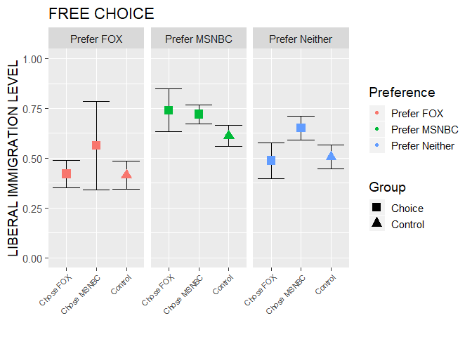

First Pass
================
Jason Neumeyer

This is the first pass I took at putting together some of the analyses
which we talked about last week. The first step I took was to create a
new variable called tv\_prefer which was just the difference between the
respondents MSNBC preference and FOX preference. In doing so, this
allowed me to determine whether the preferred MSNBC (number \> 0) or FOX
(number \< 0) rather quickly.

After this, I subset the data to include those who preferred MSNBC or
FOX and were in the control, choice, and assigned conditions. This
created the seperate subgroups from which our comparisons could be
drawn. To determine the levels of immigration support each group had, I
took the mean of our three immigration questions (immig\_increased,
taxes\_pos, jobs\_pos) and scaled them from 0 to 1 with higher numbers
indicating higher support for immigration based on these 3 questions.

NEW STUFF\!

I added in the neither category to the three groups (control, assigned,
choice) and calcuated the mean and CIs. Additionally, there are now two
ggplot graphs below which show the control vs free choice and control vs
assigned - I did not spend too much time on the formatting, so that can
always be cleaned up. I did seperate each group into its own x
coordinate because when the 3 difference preferences were shown
toegether, they were very difficult to read. Maybe there is another way
to seperate them that we could discuss?

Talk to you all soon\!

NEW NEW STUFF\!

I was able to seperate the three panels by preference in our graphs
below - I also noticed that I had made a mistake in the CIs when I
initially sent this last week. That error has been fixed, so these basic
descriptive graphs should be good to go\!

## load packages -

``` r
# library(here) # note this is not being used effectively
library(readr)
library(tidyverse)
library(ggplot2)
library(expss)
library(broom)
library(purrr)
library(stargazer)
```

## set wd and load data -

``` r
# setwd("C:/Users/Owner/Desktop/UW-Milwaukee Graduate Year 2/Lab Meeting/Data")

# dat <- read.csv("immigration_20191219_clean.csv")
dat <- read.csv("~/Dropbox/political.science/Collaboration/Lab/immigration/data/immigration_20191219_clean.csv")

## View(dat)
```

# preference variable -

``` r
tv_prefer <- dat$tv_msnbc - dat$tv_fox
dat["tv_prefer"] <- tv_prefer

## View(dat)
```

# H3 - effects of corrective information condition on preferred media choice

Here, I subset the data to include those individuals who were part of
the control group and preferred either FOX or MSNBC and calculated their
mean immigration levels based on the 3 immigration questions asked after
they would have read the story (if they were not in control). I also
calculated their CIs in the table belo.

Added those in the neither category\!

# control -

``` r
preferMSNBC_Control <- subset(dat, tv_prefer > 0 & condition == "control")
## View(preferMSNBC_Control)

preferFOX_Control <- subset(dat, tv_prefer < 0 & condition == "control")
## View(preferFOX_Control)

preferneither_control <- subset(dat, tv_prefer == 0 & condition == "control")
## View(preferneither_control)

mean_MSNBC_Control_ImmigrationLevel <- mean(preferMSNBC_Control$immig_increased) + mean(preferMSNBC_Control$taxes_pos) + mean(preferMSNBC_Control$jobs_pos)
mean_MSNBC_Control_ImmigrationLevel <- mean_MSNBC_Control_ImmigrationLevel / 3

mean_FOX_Control_ImmigrationLevel <- mean(preferFOX_Control$immig_increased) + mean(preferFOX_Control$taxes_pos) + mean(preferFOX_Control$jobs_pos)
mean_FOX_Control_ImmigrationLevel <- mean_FOX_Control_ImmigrationLevel / 3

mean_prefer_neither_ImmigrationLevel <- mean(preferneither_control$immig_increased) + mean(preferneither_control$taxes_pos) + mean(preferneither_control$jobs_pos)

mean_prefer_neither_ImmigrationLevel <- mean_prefer_neither_ImmigrationLevel / 3

## Confidence Interval - 

MSNBC_Control_ImmigrationLevel <- ((preferMSNBC_Control$immig_increased) + (preferMSNBC_Control$taxes_pos) + (preferMSNBC_Control$jobs_pos)) / 3

t1 <- t.test(MSNBC_Control_ImmigrationLevel)

FOX_Control_ImmigrationLevel <- ((preferFOX_Control$immig_increased) + (preferFOX_Control$taxes_pos) + (preferFOX_Control$jobs_pos)) / 3

t2 <- t.test(FOX_Control_ImmigrationLevel)

prefer_neither_immigrationlevel <- ((preferneither_control$immig_increased) + (preferneither_control$taxes_pos) + (preferneither_control$jobs_pos)) / 3

ta <- t.test(prefer_neither_immigrationlevel)

table1 <- map_df(list(t1, ta, t2), broom::tidy)
table1[c("estimate", "statistic", "p.value", "conf.low", "conf.high")]
```

    # A tibble: 3 x 5
      estimate statistic  p.value conf.low conf.high
         <dbl>     <dbl>    <dbl>    <dbl>     <dbl>
    1    0.612      23.6 3.19e-34    0.560     0.664
    2    0.506      16.9 5.56e-26    0.446     0.566
    3    0.415      12.0 1.09e-16    0.345     0.484

Here I subset the data for those who chose their news source. This was
subset for those who (1) preferred MSNBC and chose MSNBC, (2)preferred
MSNBC and chose FOX, (3) preferred FOX and chose FOX, and those who (4)
preferred FOX and chose MSNBC. I calculated their mean immigration
support levels (higher = more liberal) based on the 3 immigration
questions asked after they read the story. I also calculated their CIs
in the table below.

Added those in the neither category\!

# free choice -

``` r
# Prefer MSNBC & Chose MSNBC

preferMSNBC_Choice_Same <- subset(dat, tv_prefer > 0 & condition == "choice" & source == "MSNBC")
## View(preferMSNBC_Choice_Same)

mean_MSNBC_Choice_Same_ImmigrationLevel <- mean(preferMSNBC_Choice_Same$immig_increased) + mean(preferMSNBC_Choice_Same$taxes_pos) + mean(preferMSNBC_Choice_Same$jobs_pos)
mean_MSNBC_Choice_Same_ImmigrationLevel <- mean_MSNBC_Choice_Same_ImmigrationLevel / 3
mean_MSNBC_Choice_Same_ImmigrationLevel
```

    [1] 0.7202128

``` r
## Confidence Interval

MSNBC_Choice_Same_ImmigrationLevel <- ((preferMSNBC_Choice_Same$immig_increased) + (preferMSNBC_Choice_Same$taxes_pos) + (preferMSNBC_Choice_Same$jobs_pos)) / 3

t3 <- t.test(MSNBC_Choice_Same_ImmigrationLevel)

# Prefer MSNBC & Chose Fox

preferMSNBC_Choice_Diff <- subset(dat, tv_prefer > 0 & condition == "choice" & source == "Fox News")
## View(preferMSNBC_Choice_Diff)

mean_MSNBC_Choice_Diff_ImmigrationLevel <- mean(preferMSNBC_Choice_Diff$immig_increased) + mean(preferMSNBC_Choice_Diff$taxes_pos) + mean(preferMSNBC_Choice_Diff$jobs_pos)
mean_MSNBC_Choice_Diff_ImmigrationLevel <- mean_MSNBC_Choice_Diff_ImmigrationLevel / 3
mean_MSNBC_Choice_Diff_ImmigrationLevel
```

    [1] 0.7407407

``` r
## Confidence Interval

MSNBC_Choice_Diff_ImmigrationLevel <- ((preferMSNBC_Choice_Diff$immig_increased) + (preferMSNBC_Choice_Diff$taxes_pos) + (preferMSNBC_Choice_Diff$jobs_pos)) / 3

t4 <- t.test(MSNBC_Choice_Diff_ImmigrationLevel)

 # Prefer Fox & Chose Fox

preferFOX_Choice_Same <- subset(dat, tv_prefer < 0 & condition == "choice" & source == "Fox News")
## View(preferFOX_Choice_Same)

mean_FOX_Choice_Same_ImmigrationLevel <- mean(preferFOX_Choice_Same$immig_increased) + mean(preferFOX_Choice_Same$taxes_pos) + mean(preferFOX_Choice_Same$jobs_pos)
mean_FOX_Choice_Same_ImmigrationLevel <- mean_FOX_Choice_Same_ImmigrationLevel / 3
mean_FOX_Choice_Same_ImmigrationLevel
```

    [1] 0.420679

``` r
## Confidence Interval 

FOX_Choice_Same_ImmigrationLevel <- ((preferFOX_Choice_Same$immig_increased) + (preferFOX_Choice_Same$taxes_pos) + (preferFOX_Choice_Same$jobs_pos)) /  3

t5 <- t.test(FOX_Choice_Same_ImmigrationLevel)

# Prefer Fox and Chose MSNBC 

preferFOX_Choice_Diff <- subset(dat, tv_prefer < 0 & condition == "choice" & source == "MSNBC")
## View(preferFOX_Choice_Diff)

mean_FOX_Choice_Diff_ImmigrationLevel <- mean(preferFOX_Choice_Diff$immig_increased) + mean(preferFOX_Choice_Diff$taxes_pos) + mean(preferFOX_Choice_Diff$jobs_pos)
mean_FOX_Choice_Diff_ImmigrationLevel <- mean_FOX_Choice_Diff_ImmigrationLevel / 3
mean_FOX_Choice_Diff_ImmigrationLevel
```

    [1] 0.562963

``` r
## Confidence Interval

FOX_Choice_Diff_ImmigrationLevel <- ((preferFOX_Choice_Diff$immig_increased) + (preferFOX_Choice_Diff$taxes_pos) + (preferFOX_Choice_Diff$jobs_pos)) / 3

t6 <- t.test(FOX_Choice_Diff_ImmigrationLevel)

## Prefer Neither, Chose MSNBC

preferneither_Choose_MSNBC <- subset(dat, tv_prefer == 0 & condition == "choice" & source == "MSNBC")
## View(preferneither_Choose_MSNBC)

mean_preferneither_ChoseMSNBC_ImmigrationLevel <- mean(preferneither_Choose_MSNBC$immig_increased) + mean(preferneither_Choose_MSNBC$taxes_pos) + mean(preferneither_Choose_MSNBC$jobs_pos)
mean_preferneither_ChoseMSNBC_ImmigrationLevel <- mean_preferneither_ChoseMSNBC_ImmigrationLevel / 3
mean_preferneither_ChoseMSNBC_ImmigrationLevel
```

    [1] 0.6511905

``` r
## Confidence Interval - 

preferneither_Choose_MSNBC_immigrationlevel <- ((preferneither_Choose_MSNBC$immig_increased) + (preferneither_Choose_MSNBC$taxes_pos) + (preferneither_Choose_MSNBC$jobs_pos)) / 3

tb <- t.test(preferneither_Choose_MSNBC_immigrationlevel)

## Prefer Neither, Chose FOX

preferneither_Choose_FOX <- subset(dat, tv_prefer == 0 & condition == "choice" & source == "Fox News")
## View(preferneither_Choose_FOX)

mean_preferneither_ChoseFOX_ImmigrationLevel <- mean(preferneither_Choose_FOX$immig_increased) + mean(preferneither_Choose_FOX$taxes_pos) + mean(preferneither_Choose_FOX$jobs_pos)
mean_preferneither_ChoseFOX_ImmigrationLevel <- mean_preferneither_ChoseFOX_ImmigrationLevel / 3
mean_preferneither_ChoseFOX_ImmigrationLevel
```

    [1] 0.4877451

``` r
## Confidence Interval - 

preferneither_Choose_FOX_immigrationlevel <- ((preferneither_Choose_FOX$immig_increased) + (preferneither_Choose_FOX$taxes_pos) + (preferneither_Choose_FOX$jobs_pos)) / 3

tc <- t.test(preferneither_Choose_FOX_immigrationlevel)

table2 <- map_df(list(t3, t4, t5, t6, tb, tc), broom::tidy)
table2[c("estimate", "statistic", "p.value", "conf.low", "conf.high")]
```

    # A tibble: 6 x 5
      estimate statistic  p.value conf.low conf.high
         <dbl>     <dbl>    <dbl>    <dbl>     <dbl>
    1    0.720     30.8  2.40e-32    0.673     0.767
    2    0.741     15.8  2.51e- 7    0.633     0.849
    3    0.421     12.0  8.58e-17    0.351     0.491
    4    0.563      5.82 3.96e- 4    0.340     0.786
    5    0.651     22.2  1.73e-24    0.592     0.710
    6    0.488     11.0  1.31e-12    0.398     0.578

## plot control vs. free choice

Control vs Free Choice - Updated plot with accurate CIs and seperate
panels

``` r
data <- data.frame(x = c("Control", "Control", "Control", "Chose MSNBC", "Chose FOX", "Chose FOX", "Chose MSNBC", "Chose MSNBC", "Chose FOX"),
                   y    = c(mean_MSNBC_Control_ImmigrationLevel, mean_FOX_Control_ImmigrationLevel, mean_prefer_neither_ImmigrationLevel, mean_MSNBC_Choice_Same_ImmigrationLevel, mean_FOX_Choice_Same_ImmigrationLevel, mean_MSNBC_Choice_Diff_ImmigrationLevel, mean_FOX_Choice_Diff_ImmigrationLevel, mean_preferneither_ChoseMSNBC_ImmigrationLevel, mean_preferneither_ChoseFOX_ImmigrationLevel),
                   CHI = c(0.052, 0.07, 0.06, 0.047, 0.07, 0.108, 0.223, 0.059, 0.09),
                   CLO = c(0.052, 0.07, 0.06, 0.047, 0.07, 0.108, 0.223, 0.059, 0.09),
                   Preference = c("Prefer MSNBC", "Prefer FOX", "Prefer Neither", "Prefer MSNBC", "Prefer FOX", "Prefer MSNBC", "Prefer FOX", "Prefer Neither", "Prefer Neither"),
                   Group = c("Control", "Control", "Control", "Choice", "Choice", "Choice", "Choice", "Choice", "Choice"))

Choice <- ggplot(data, aes(x, y, group = Preference)) +
  geom_point() +
  geom_errorbar(aes(ymin = y + CHI, ymax = y - CLO)) +
  labs(x = "",
       y = "LIBERAL IMMIGRATION LEVEL",
       title = "FREE CHOICE") +
  theme_classic() + 
  geom_point(aes(color =Preference, shape=Group, size = Group)) + 
  scale_shape_manual(values=c(15, 17, 16)) +
  scale_size_manual(values=c(4,4,4)) +
  theme_gray(base_size = 14) + 
  theme(axis.text.x = element_text(angle = 45, size = 8, hjust = 1))+
  facet_wrap(~Preference, ncol = 3, scales = "free_x") +
  ylim(c(0:1))

Choice
```

<!-- -->

# assigned -

Here I subset the data for those who were assigned their news source.
This was subset for those who (1) preferred MSNBC and were assigned
MSNBC, (2)preferred MSNBC and were assigned FOX, (3) preferred FOX and
were assigned FOX, and those who (4) preferred FOX and were assigned
MSNBC. I calculated their mean immigration support levels (higher = more
liberal) based on the 3 immigration questions asked after they read the
story. I also calculated their CIs in the table below.

Added those in the neither category\!

``` r
## Prefer MSNBC, Assinged MSNBC

preferMSNBC_assignedMSNBC <- subset(dat, tv_prefer > 0 & condition == "assigned" & source == "MSNBC")
## View(preferMSNBC_assignedMSNBC)

mean_preferMSNBC_assignedMSNBC_ImmigrationLevel <- mean(preferMSNBC_assignedMSNBC$immig_increased) + mean(preferMSNBC_assignedMSNBC$taxes_pos) + mean(preferMSNBC_assignedMSNBC$jobs_pos)
mean_preferMSNBC_assignedMSNBC_ImmigrationLevel <- mean_preferMSNBC_assignedMSNBC_ImmigrationLevel / 3
mean_preferMSNBC_assignedMSNBC_ImmigrationLevel
```

    [1] 0.6720721

``` r
## Confidence interval - 

preferMSNBC_assignedMSNBC_ImmigrationLevel <- ((preferMSNBC_assignedMSNBC$immig_increased) + (preferMSNBC_assignedMSNBC$taxes_pos) + (preferMSNBC_assignedMSNBC$jobs_pos)) / 3

t7 <- t.test(preferMSNBC_assignedMSNBC_ImmigrationLevel)

## Prefer MSNBC, Assigned FOX

preferMSNBC_assignedFOX <- subset(dat, tv_prefer > 0 & condition == "assigned" & source == "Fox News")
## View(preferMSNBC_assignedFOX)

mean_preferMSNBC_assignedFOX_ImmigrationLevel <- mean(preferMSNBC_assignedFOX$immig_increased) + mean(preferMSNBC_assignedFOX$taxes_pos) + mean(preferMSNBC_assignedFOX$jobs_pos)
mean_preferMSNBC_assignedFOX_ImmigrationLevel <- mean_preferMSNBC_assignedFOX_ImmigrationLevel / 3
mean_preferMSNBC_assignedFOX_ImmigrationLevel
```

    [1] 0.6703704

``` r
## Confidence Intervals - 

preferMSNBC_assignedFOX_ImmigrationLevel <- ((preferMSNBC_assignedFOX$immig_increased) + (preferMSNBC_assignedFOX$taxes_pos) + (preferMSNBC_assignedFOX$jobs_pos)) / 3

t8 <- t.test(preferMSNBC_assignedFOX_ImmigrationLevel)

## Prefer Fox, Assigned FOX

preferFOX_assignedFOX <- subset(dat, tv_prefer < 0 & condition == "assigned" & source == "Fox News")
## View(preferFOX_assignedFOX)

mean_preferFOX_assignedFOX_ImmigrationLevel <- mean(preferFOX_assignedFOX$immig_increased) + mean(preferFOX_assignedFOX$taxes_pos) + mean(preferFOX_assignedFOX$jobs_pos)
mean_preferFOX_assignedFOX_ImmigrationLevel <- mean_preferFOX_assignedFOX_ImmigrationLevel / 3
mean_preferFOX_assignedFOX_ImmigrationLevel
```

    [1] 0.5220238

``` r
## Confidence Intervals - 

preferFOX_assignedFOX_ImmigrationLevel <- ((preferFOX_assignedFOX$immig_increased) + (preferFOX_assignedFOX$taxes_pos) + (preferFOX_assignedFOX$jobs_pos)) / 3

t9 <- t.test(preferFOX_assignedFOX_ImmigrationLevel)

## Prefer FOX, Assigned MSNBC

preferFOX_assignedMSNBC <- subset(dat, tv_prefer < 0 & condition == "assigned" & source == "MSNBC")
## View(preferFOX_assignedMSNBC)

mean_preferFOX_assignedMSNBC_ImmigrationLevel <- mean(preferFOX_assignedMSNBC$immig_increased) + mean(preferFOX_assignedMSNBC$taxes_pos) + mean(preferFOX_assignedMSNBC$jobs_pos)
mean_preferFOX_assignedMSNBC_ImmigrationLevel <- mean_preferFOX_assignedMSNBC_ImmigrationLevel / 3
mean_preferFOX_assignedMSNBC_ImmigrationLevel
```

    [1] 0.4787037

``` r
## Confidence Intervals - 

preferFOX_assignedMSNBC_ImmigrationLevel <- ((preferFOX_assignedMSNBC$immig_increased) + (preferFOX_assignedMSNBC$taxes_pos) + (preferFOX_assignedMSNBC$jobs_pos)) / 3

t10 <- t.test(preferFOX_assignedMSNBC_ImmigrationLevel)

## Prefer neither, Assigned MSNBC

preferneither_assignedMSNBC <- subset(dat, tv_prefer == 0 & condition == "assigned" & source == "MSNBC")
## View(preferFOX_assignedMSNBC)

mean_preferneither_assignedMSNBC_ImmigrationLevel <- mean(preferneither_assignedMSNBC$immig_increased) + mean(preferneither_assignedMSNBC$taxes_pos) + mean(preferneither_assignedMSNBC$jobs_pos)
mean_preferneither_assignedMSNBC_ImmigrationLevel <- mean_preferneither_assignedMSNBC_ImmigrationLevel / 3
mean_preferneither_assignedMSNBC_ImmigrationLevel
```

    [1] 0.5818627

``` r
## Confidence Intervals - 

preferneither_assignedMSNBC_ImmigrationLevel <- ((preferneither_assignedMSNBC$immig_increased) + (preferneither_assignedMSNBC$taxes_pos) + (preferneither_assignedMSNBC$jobs_pos)) / 3

td <- t.test(preferneither_assignedMSNBC_ImmigrationLevel)

## Prefer neither, Assigned MSNBC

preferneither_assignedFOX <- subset(dat, tv_prefer == 0 & condition == "assigned" & source == "Fox News")
## View(preferFOX_assignedFOX)

mean_preferneither_assignedFOX_ImmigrationLevel <- mean(preferneither_assignedFOX$immig_increased) + mean(preferneither_assignedFOX$taxes_pos) + mean(preferneither_assignedFOX$jobs_pos)
mean_preferneither_assignedFOX_ImmigrationLevel <- mean_preferneither_assignedFOX_ImmigrationLevel / 3
mean_preferneither_assignedFOX_ImmigrationLevel
```

    [1] 0.6387255

``` r
## Confidence Intervals - 

preferneither_assignedFOX_ImmigrationLevel <- ((preferneither_assignedFOX$immig_increased) + (preferneither_assignedFOX$taxes_pos) + (preferneither_assignedFOX$jobs_pos)) / 3

te <- t.test(preferneither_assignedFOX_ImmigrationLevel)

table3 <- map_df(list(t1, t2, t6, t7, t8, t9, td, te), broom::tidy)
table3[c("estimate", "statistic", "p.value", "conf.low", "conf.high")]
```

    # A tibble: 8 x 5
      estimate statistic  p.value conf.low conf.high
         <dbl>     <dbl>    <dbl>    <dbl>     <dbl>
    1    0.612     23.6  3.19e-34    0.560     0.664
    2    0.415     12.0  1.09e-16    0.345     0.484
    3    0.563      5.82 3.96e- 4    0.340     0.786
    4    0.672     20.2  3.01e-21    0.605     0.739
    5    0.670     15.0  2.50e-14    0.579     0.762
    6    0.522     12.7  6.50e-13    0.438     0.606
    7    0.582     14.0  1.93e-15    0.497     0.666
    8    0.639     19.7  7.92e-20    0.573     0.705

# combine and plot -

Control vs Assigned - Updated plot with accurate CIs and seperate panels

``` r
data2 <- data.frame(x2 = c("Control", "Control", "Control", "Assigned MSNBC", "Assigned FOX", "Assigned FOX", "Assigned MSNBC", "Assigned MSNBC", "Assigned FOX"),
                    y2    = c(mean_MSNBC_Control_ImmigrationLevel, mean_FOX_Control_ImmigrationLevel, mean_prefer_neither_ImmigrationLevel, mean_preferMSNBC_assignedMSNBC_ImmigrationLevel, mean_preferFOX_assignedFOX_ImmigrationLevel, mean_preferMSNBC_assignedFOX_ImmigrationLevel, mean_preferFOX_assignedMSNBC_ImmigrationLevel, mean_preferneither_assignedMSNBC_ImmigrationLevel, mean_preferneither_assignedFOX_ImmigrationLevel),
                    CHI_2 = c(0.052, 0.07, 0.06, 0.067, 0.084, 0.091, 0.114, 0.085, 0.066),
                    CLO_2 = c(0.052, 0.07, 0.06, 0.067, 0.084, 0.091, 0.114, 0.085, 0.066),
                    Preference2 = c("Prefer MSNBC", "Prefer FOX", "Prefer Neither", "Prefer MSNBC", "Prefer FOX", "Prefer MSNBC", "Prefer FOX", "Prefer Neither", "Prefer Neither"),
                    Group = c("Control", "Control", "Control", "Assigned", "Assigned", "Assigned", "Assigned", "Assigned", "Assigned"))

Assigned <- ggplot(data2, aes(x2, y2, group = Preference2)) +
  geom_point() +
  geom_errorbar(aes(ymin = y2 + CHI_2, ymax = y2 - CLO_2)) +
  labs(x = "",
       y = "LIBERAL IMMIGRATION LEVEL",
       title = "ASSIGNED") +
  theme_classic() + 
  geom_point(aes(color=Preference2, shape=Group, size = Group)) + 
  scale_shape_manual(values=c(15, 17, 16)) +
  scale_size_manual(values=c(4,4,4)) +
  theme_gray(base_size = 14) + 
  theme(axis.text.x = element_text(angle = 45, size = 8, hjust = 1)) +
  facet_wrap(~Preference2, ncol = 3, scales = "free_x") +
  ylim(c(0:1))

Assigned
```

<!-- -->

# OLS Analysis

``` r
libimm_data <- dat %>% select(immig_increased, taxes_pos, jobs_pos, condition)
libimm_data$condition <- as.factor(libimm_data$condition)

libimm <- rowMeans(subset(libimm_data, select = c(immig_increased, taxes_pos, jobs_pos)), na.rm = TRUE)
libimm_data <- cbind(libimm_data, libimm)
libimm_data$libimm <- as.numeric(libimm_data$libimm)


libimm_data$condition <- relevel(libimm_data$condition, ref = "control")

## View(libimm_data)

test1 <- lm(libimm ~ condition, data = libimm_data)
```

``` r
stargazer(test1, type = "text")
```

``` 

===============================================
                        Dependent variable:    
                    ---------------------------
                              libimm           
-----------------------------------------------
conditionassigned            0.082***          
                              (0.024)          
                                               
conditionchoice               0.057**          
                              (0.024)          
                                               
Constant                     0.522***          
                              (0.017)          
                                               
-----------------------------------------------
Observations                    600            
R2                             0.020           
Adjusted R2                    0.016           
Residual Std. Error      0.241 (df = 597)      
F Statistic           5.966*** (df = 2; 597)   
===============================================
Note:               *p<0.1; **p<0.05; ***p<0.01
```
