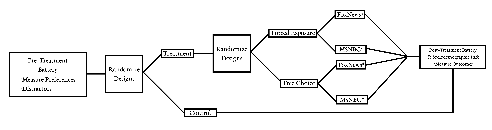

```{r setup, include=FALSE}
knitr::opts_chunk$set(echo = TRUE, fig.height = 2.5, fig.width = 5)
```

# 1. Summary

This document describes the pre-analysis plan for an online survey on media usage and news consumption regarding political issues. The survey seeks to learn about media viewing habits of individuals, especially on social media platforms, and how this impacts their political attitudes. In this survey experiment, participants will answer questions about their use of different media sources, political leanings, and attitudes toward current issues covered in the news. Depending on the experimental condition, participants will be asked to choose, or be assigned to, an article published by different news channels (Fox News vs. MSNBC), which discusses the economic impact of legal immigration. After reading the article, participants are asked to evaluate the news story and answer general questions about their attitudes towards immigration.

# 2. Research Design

## 2.1 Hypotheses

The survey experiment is designed based on existing research that examines the relationship between corrective information and attitude change. Some studies show that correcting misinformation does not always lead to attitude change (Hopkins et al. 2019; Swire-Thompson et al. 2019) while others find that media can persuade people to change their attitudes under under certain conditions (e.g. De Benedictis-Kessner et al. 2019). 

To examine the differential effects of corrective information on attitude change, we need to look at two different processes of adopting new information: information seeking and information interpreting. 

Selective exposure to information via different media sources may lead individuals to engage in a biased search process, seeking out information that supports their preconceptions and avoiding evidence that undercuts their beliefs (see Taber and Lodge 2006). This leads our first set of hypotheses regarding endogenous information search and its effectiveness.

_H 1: When free to choose what information they will expose themselves to, people will seek out confirming over disconfirming arguments._

_H2: Allowing people to choose their preferred information source makes corrective information more effective._

[Lit reviews on preferred info source and persuasion]

In allowing for an endogenous information search in our survey design, we can manipulate the information search process. Not only do we expect that people seek confirming information, but those allowed to seek information will be more likely to their update beliefs than those assigned corrective information. 

However, how individuals treat facts and other types of information depends on their motivation and ability to interpret such information (Lodge and Taber 2006). Without substantial motivation to accurately process information, individuals may interpret new information through the prism of their extant attitudes. 

_H3: Those who receive information from ‘friendly’ sources are more likely to update beliefs._ 

[Lit review on the effect of cues/heuristics on interpreting information]

We expect that citizens are more likely to alter their attitudes when the source is perceived as sympathetic to ideological predispositions.

## 2.2 Treatment Effects and Measurement

- **Basic design:** 3-arm (choice/assigned + control)

- _Treatment (choice/assigned):_ Before being able to view their contents, participants are either asked to choose between a Fox News or MSNBC tweet, or they are randomly assigned to one of them. In any case, the content of the tweet is held constant. After reading the tweet, participants are asked to read the full article linked in the tweet.
- _Control condition:_ skip tweet & full story

- **Outcome measures:**
	- Do participants try to click on the tweet? (i.e., multiple clicks)
	- How much time do participants spend viewing the tweet?
	- How much time do participants spend on the full article?
	- Basic comprehension / attention check.
	- Attitudes towards immigration (see post-treatment section).
	- Trust in news sources (see post-treatment section).

## 2.3 Our Design

In our design, we randomly assign participants to a free choice treatment condition, a forced exposure treatment condition, or a control group. If one is put into the free choice condition, that participant will select whether he/she wants to see a recent breaking news tweet from either FoxNews or MSNBC and will subsequently be given a link to a full length article related to the tweet. In either case, the participant will receive the exact same full length vignette regarding immigrant owned businesses which has been “written” by a contributor for either FoxNews or MSNBC. Alternatively, if one is randomly assigned to the forced exposure group, he/she will not have an option to select which news organization (FoxNews or MSNBC) the tweet and article come from.

Finally, if a participant is randomly assigned to the control group, he/she would move directly from the pre-treatment battery (questions on media usage, stereotyping, and political attitudes and behavior) to the post-treatment battery (questions on attitudes toward immigrant taxation and jobs, and trust in different media sources). Ultimately, this group would completely skip the treatment of either selecting a tweet and story or being forced to read it from the two sources. See the diagram below for more details about the design.



## 2.4 Main Variables of Interest

Ultimately, we have two main variables of interest which coincide with our three main hypotheses found above. Our first variable of interest is the difference between the pre- and post-treatment immigration attitudes for those participants who either chose or received FoxNews versus MSNBC. In the end, we would expect those that read a news story from a source which was consistent with their priors to update their views positively toward immigrants, given that the story has a pro-immigrant lean (H3). Additionally, we would expect that those who could choose their source would pick the source which is similar to their current media diet (H1). 
Our second major variable of interest takes this analysis one step further. Instead of simply looking at the differences between the two sources, we look at the difference-in-differences between those who were allowed to choose their source and those who were assigned (H2). This measure takes into account the same pre- and post-treatment immigration attitude questions and determines how individuals update their beliefs on immigration when they are either given a choice or are assigned the source from which they receive the information.

In addition to these two main outcomes, we also evaluate four other outcome measures and conduct a simple manipulation check:

Click on the Link Outcome:
	
The first outcome measure we can capture is whether or not the participant voluntarily clicks on the link included in the tweet.  Because the participants will never be prompted to click this link within the directions of the survey, their willingness to do so may help us to measure their level of engagement with the content.

**Time Spent on the Tweet and Story Outcome:**

We will also measure the amount of time that individuals spend reading the tweet and story.  Although the time spent on the tweet will not be very informative on its own, it may allow us to capture non-compliance.  The next button on the survey will not appear until ten seconds have passed; therefore, if we record the time, we will be able to tell if the respondent was uninterested in engaging in the article at all. This may also help us to identify those people who were assigned to the source which was opposed to their priors – someone who watches MSNBC daily may be less likely to engage with a story which was “written” by a FoxNews contributor.

**Sharing Outcome:**

Our fourth outcome measure will look at the likelihood that the participant would share this story, either with a friend or on social media, or if he/she would be likely to seek out more information regarding the topic of the tweet and story. This measure aligns with recent research (De Benedictis-Kessner et al. 2019) and may be used to capture differences in the propensity to share between those who prefer one source over the other and between those who could choose and those who were assigned a source. 

**Evaluation of the Article Outcome:**

Our final outcome measure will be a basic evaluation of the article, asking participants to disclose if they found the article fair or unfair, hostile or friendly, bad or good, skewed or balanced, American or un-American, and accurate or inaccurate.  This is another measure which follows closely the work done by De Benedictis-Kessner et al. and should help us further determine the impact of the main treatment: whether the participants’ ability to choose his/her source had a significant difference on immigration attitudes compared to those who were assigned.

**Manipulation Check:**

In order to ensure that the tweet and vignette were actually read, we have included a brief manipulation check as well. Here, those who were in the treatment groups will read and respond to two specific questions about the article to ensure that they read and understood the material. This outcome measure is an important aspect of any experimental design – if the participants are not taking in the information found in our treatment, we cannot accurately evaluate their outcome responses whatsoever.

## 2.5 Details of Study

Sampling and Procedures, data collection -> Mturk 

### Intervention

**Check list**

- [ ] Technical components of the intervention (e.g. drug or technology).
- [ ] Differences between the treatment and control arms
- [ ] flow chart (optional)


### Randomization

**Check list**

- [ ] Detailed description of the mechanism for randomizing, including how the process will be safeguarded from tampering
- [ ] Individual vs. clustered randomization?
- [ ] Stratification variables?

### Power calculations

**Check list**
- [ ] Justification of effect size used in power calculations


